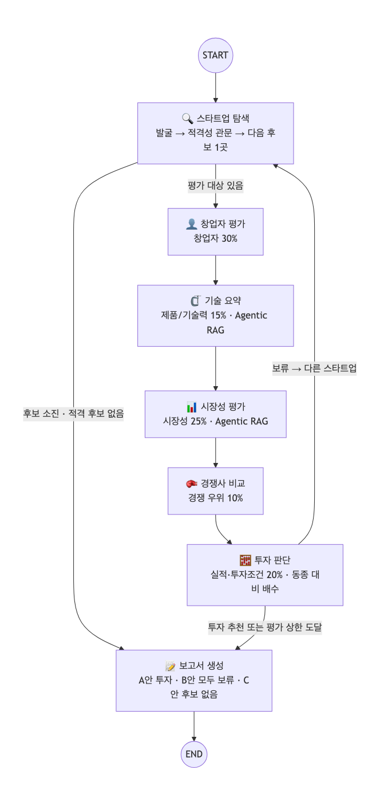
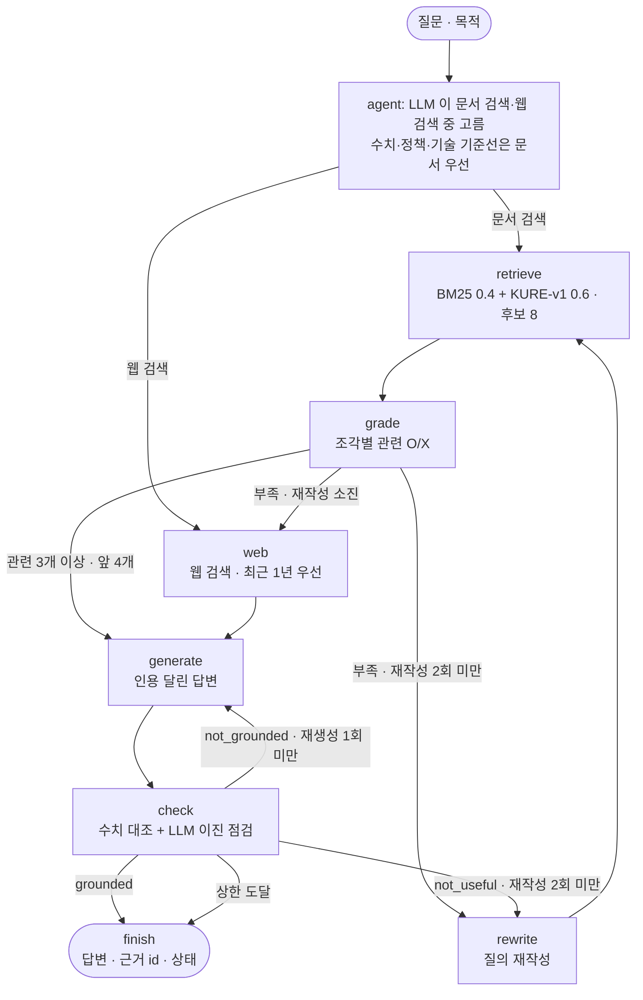

# AI Startup Investment Evaluation Agent
공개 정보만으로 AgTech AI 스타트업을 찾아 평가하고, 투자 · 보류 판단과 그 근거를 5쪽 이내 보고서로 만드는 LangGraph 멀티 에이전트입니다.

<p>


</p>

SKALA 울산캠퍼스 2반 1조 · 📄 투자 보고서 [PDF](outputs/RAG-Output_%EC%9A%B8%EC%82%B0-2%EB%B0%98_%EA%B9%80%EA%B0%80%EC%97%B0%2B%EA%B9%80%EC%A7%84%EB%85%95%2B%EB%AC%B8%EC%A7%80%ED%9B%84%2B%EC%9D%B4%EC%A4%80%ED%9D%AC%2B%EC%A0%95%EC%8A%B9%EC%9A%B0.pdf) · 📐 설계서 [PDF](docs/RAG-Design_%EC%9A%B8%EC%82%B0-2%EB%B0%98_%EA%B9%80%EA%B0%80%EC%97%B0%2B%EA%B9%80%EC%A7%84%EB%85%95%2B%EB%AC%B8%EC%A7%80%ED%9B%84%2B%EC%9D%B4%EC%A4%80%ED%9D%AC%2B%EC%A0%95%EC%8A%B9%EC%9A%B0.pdf) / [Markdown](docs/design.md)

> [!IMPORTANT]
> **결론** · 메타파머스 투자 추천(실사 조건부) — 동종 평균 대비 **109.6** (동종 평균 100 초과, 창업자 기준 118.1), 동종 10곳 중 1위<br>
> **기준** · Scorecard(Payne)의 동종 기업 비교 + Bessemer 체크리스트 10문 → 24문항. YES·NO 는 원문 인용이 확인될 때만 인정<br>
> **검증** · 검색 Hit@4 0.986 · MRR@4 0.831 · 적격성 판정 정확도 0.95 (홀드아웃 1.00)<br>
> **재현** · API 키 없이 `python app.py` 한 줄로 같은 보고서

### 한눈에 보기
1. **결론** — 공개 정보만으로 국내외 AgTech AI 스타트업 78곳을 찾아 과제 조건을 통과한 14곳 중 10곳을 평가했고, 투자 기준을 넘은 3곳 중 1위인 **메타파머스를 실사 조건부로 투자 추천**한다. 투자를 받은 동종 기업 평균을 100 으로 놓으면 **109.6**, 창업자 기준은 **118.1** 이다
2. **방법** — 기준은 새로 만들지 않고 과제가 준 **Scorecard(비중) · Bessemer(질문)** 를 원 방법대로 썼다. LLM 은 원문 인용을 찾아 24문항에 YES / NO / 미확인으로 **답만** 하고, 인용 검증 · 점수 · 투자/보류 **결정은 코드**가 계산한다
3. **한계와 정직성** — 추천 대상도 24문항 중 **65%가 미확인**이고, 실제 투자를 받은 기업 3곳 중 **1곳만** 추천됐다. 그래서 결론은 '투자 결정'이 아니라 **'실사 대상 선별'** 이다. 설계서 제출 뒤 판단 기준(110 → 100)과 평가 흐름(첫 추천에서 멈춤 → 10곳 모두 평가)을 바꾼 사실과 이유도 [아래](#설계서-제출-이후-바뀐-것)에 적었다

**바로가기** · [Overview](#overview) · [Features](#features) · [Tech Stack](#tech-stack) · [Agents](#agents) · [Architecture](#architecture) · [Usage](#usage) · [차별점](#차별점) · [Evaluation](#evaluation) · [투자 보고서 핵심](#투자-보고서-핵심) · [Lessons Learned](#lessons-learned) · [한계와 변경](#알려진-한계와-문제-해결) · [Contributors](#contributors)

## Overview
> **쉽게 말해** · 인터넷에 공개된 자료만 보고 "이 농업 AI 스타트업에 투자할 만한가"를 AI 에이전트들이 나눠 조사하고, 점수와 결론은 코드가 계산해 근거 달린 보고서로 냅니다.

- Objective : 공개 정보만으로 국내외 AgTech AI 스타트업(비상장 · Seed~Series C · Exit 전)을 찾아 창업자 · 시장성 · 제품/기술력 · 경쟁 우위 · 실적 · 투자조건 6개 기준으로 **투자 / 보류**를 판단하고, 모든 판단의 근거를 추적할 수 있는 5쪽 이내 보고서를 만든다
- Method : LangGraph Multi-Agent 7개(가이드 6개 + 창업자 평가) · Agentic RAG(공공·연구기관 문서 15종 199쪽 + 웹) · Scorecard 동종 비교 — LLM 은 근거를 찾아 판정하고, 인용 검증 · 점수 · 결론은 코드가 맡는다

## Features
> **쉽게 말해** · 후보 찾기 → 자격 검사 → 기준별 조사 → 점수 계산 → 보고서까지 한 번에 돌고, 근거를 못 찾은 것은 '모른다'로 남깁니다.

- **후보 발굴** : 투자 단계가 드러나는 공개 채널 8개(TIPS 선정 · 투자 기사 · 공공 선정 · 기업 DB · 수상 · 문서 RAG 등)에서 수집 — 이번 실행 78곳
- **적격성 관문 G1~G6** : 비상장(한국거래소 KIND 목록과 코드 대조) · Seed~Series C · Exit 전 · 부정 신호 · AgTech AI · 최소 근거량. 확인하지 못하면 탈락 — 통과 14곳
- **1 에이전트 = 1 Scorecard 기준** : 창업자 · 기술 요약 · 시장성 · 경쟁사 에이전트가 자기 기준의 4문항을 판정하고, 실적 · 투자조건은 투자 판단 에이전트가 판정
- **Agentic RAG** : 질문마다 LLM 이 문서/웹 도구를 고름 → 조각별 관련성 판정 → 질의 재작성(최대 2회) → 웹 보완 → 인용 달린 답변 → 근거 점검(재생성 최대 1회)
- **코드가 계산하는 결론** : 24문항 YES / NO / 미확인 → 동종 평균 대비 배수 → 투자 / 보류. 보류면 다음 후보로 돌아가며 뒤집힘 조건을, 투자면 실사 항목과 ROI 참고치를 붙임
- **형식까지 검사하는 보고서** : 결론별 목차(A 투자 추천 / B 모두 보류 / C 후보 없음). 5쪽 · SUMMARY 반 쪽 · REFERENCE 형식 · 평가표와의 일치를 PDF 렌더링 후 코드로 검사
- **키 없는 재현** : 검색 결과 · LLM 응답 · FAISS 색인 · 질의 임베딩을 `replay/` 에 저장

## Tech Stack
> **쉽게 말해** · 흐름은 LangGraph, 판단은 gpt-4.1-mini, 문서 검색은 한국어에 강한 오픈소스 임베딩(KURE-v1)과 단어 검색(BM25)을 섞어 씁니다.

- Framework : LangGraph, LangChain (Python 3.11)
- LLM/Generator : gpt-4.1-mini (OpenAI API, temperature 0)
- LLM/Judge : gpt-4.1-mini (문서 관련성 판정 · 평가표 문항 판정 · 답변 점검)
- Retrieval : FAISS + Kiwi BM25, 하이브리드 BM25 0.4 : Dense 0.6 (RRF) - Hit Rate@4 0.986, MRR@4 0.831 (질문 70개, 실제 설정: 후보 8개 중 앞 4개 사용)
- Embedding : nlpai-lab/KURE-v1 (오픈소스 · 후보 6종을 자체 질문으로 비교해 선정)
- 그 밖 : 웹 검색 Serper(구글)·Tavily · 기사 원문 trafilatura · 국민연금 가입 사업장(공공데이터) · 한국거래소 KIND · Playwright(PDF)

## Agents
> **쉽게 말해** · 투자 심사팀처럼 역할을 나눴습니다. 에이전트 하나가 Scorecard 기준 하나를 맡고, 최종 판단은 계산 담당이 합니다.

| 에이전트 | 하는 일 | 도구 · RAG | Scorecard 기준 |
|---|---|---|---|
| 🔍 스타트업 탐색 | 발굴 → 적격성 관문 G1~G6 → 대기열에서 다음 후보 1곳 | 웹 검색 · 문서 검색 · 상장 목록 · 국민연금 | 관문(통과/탈락) |
| 👤 창업자 평가 (추가) | 창업 시점 t0 를 먼저 고정 → 창업 전 전문성, 창업 후 24개월 실행력 | 웹 검색 · 기사 원문 · 국민연금 | 창업자 30% |
| 🗜️ 기술 요약 | 핵심 기술 · 장단점 · 차별점 주장을 분야 기술 기준선과 비교 | 문서 요약 · **Agentic RAG** | 제품/기술력 15% |
| 📊 시장성 평가 | 시장 질문을 하위 질문 3~6개로 나눠 질문마다 문서/웹 선택 | **Agentic RAG** | 시장성 25% |
| 🥊 경쟁사 비교 | 제품 유형이 같은 국내외 경쟁사와 비교, 기술 요약의 차별점 주장 검증 | 웹 검색 | 경쟁 우위 10% |
| 🧮 투자 판단 | 실적 · 투자조건 판정 → 동종 대비 배수 · Deal-killer → 투자/보류, 뒤집힘 조건 · 실사 항목 · ROI | 코드 계산 | 실적 10% · 투자조건 10% |
| 📝 보고서 생성 | 단계별 결과를 장마다 연결해 PDF, 형식 · 평가표 일치 검사 | Playwright | — |

가이드의 Agent 정의(안) 6개에 **창업자 평가**를 더했다. Scorecard 에서 비중이 가장 큰 창업자 30% 를 한 에이전트가 전담한다.

## Architecture
> **쉽게 말해** · 후보 1곳씩 조사 → 판정을 반복해 최대 10곳을 본 뒤, 투자 기준을 넘은 곳 중 1위를 보고서로 씁니다.



- **Workflow** : 탐색 → 창업자 → 기술 요약 → 시장성 → 경쟁사 → 투자 판단 (후보 1곳씩)
- **Branch · Loop** : 투자 판단 뒤 다음 후보 탐색으로 돌아감(보류는 가이드대로 다른 후보로, 투자 추천이어도 멈추지 않음) / 평가 상한 · 후보 소진 · 적격 후보 없음 → 보고서
- **대상 선정** : 투자 기준 통과 후보 중 동종 평균 대비 배수 1위를 보고서 대상으로, 통과 후보가 없으면 모두 보류 보고서 — 먼저 평가한 후보가 결론이 되지 않게 한다
- **종료 조건** : 발굴 최대 2라운드 · 심층 평가 최대 10곳(공용 키 비용 관리) · recursion_limit 100 · RAG 재작성 2회 · 재생성 1회
- State 표 · 탐색 서브그래프 · 간선 목록은 [설계서 D장](docs/design.md#d-그래프-설계)

<details>
<summary>Agentic RAG 서브그래프 (기술 요약 · 시장성 에이전트가 호출)</summary>



</details>

## Directory Structure
<details>
<summary>폴더 구조 펼치기</summary>

```
├── app.py           # 실행 스크립트 (재현 · 새 평가 · 보정 · 시나리오)
├── config.yaml      # 모델명 · 검색 · 상한 · 판단 기준 (코드에 값을 박지 않음)
├── rubric.yaml      # 평가표 24문항 · Bessemer 대응 · 관문 · Deal-killer · 결정 규칙
├── agents/          # 에이전트 7개 (discovery · eligibility 는 탐색 에이전트의 내부 단계)
├── graph/           # State, 메인 그래프, 탐색 서브그래프, 분기 함수
├── rag/             # 문서 로딩 · 청킹, 임베딩, 하이브리드 검색, Agentic RAG 서브그래프
├── tools/           # 에이전트 도구(@tool), 웹 검색, 발굴 채널, 상장 목록, 국민연금, 기사 원문, 근거 저장소
├── core/            # 설정, LLM, 평가표 판정(인용 검증), 최근성 규칙, 비용 집계
├── prompts/         # 프롬프트 템플릿
├── report/          # 보고서 템플릿 · PDF 렌더링
├── data/            # RAG 문서 15종 199쪽(corpus/), 문서 목록(manifest.yaml), 동종 기준 집단, 평가 정답(eval/)
├── eval/            # 검색 · 적격성 · Judge · 양성 대조 평가 스크립트
├── outputs/         # 투자 보고서 PDF, 실행 로그, 평가 결과(eval/)
├── replay/          # 재현용 캐시 (검색 결과 · LLM 응답 · FAISS 색인 · 질의 임베딩)
├── docs/            # 설계서, 그래프 그림, README 생성기
├── tests/           # 계약 · 라우팅 · 판정 · 최근성 테스트
└── README.md        # docs/README.md.j2 에서 생성 (숫자는 outputs/ · data/ 에서 채움)
```

</details>

## Usage
> **쉽게 말해** · 설치 후 `python app.py` 한 줄이면 API 키 없이 제출한 보고서가 그대로 다시 만들어집니다.

```bash
python3.11 -m venv .venv && source .venv/bin/activate   # Python 3.11 (Windows: .venv\Scripts\activate)
pip install -r requirements.txt                          # 버전 고정 목록
python -m playwright install chromium                    # PDF 를 만드는 브라우저 (처음 한 번)
python app.py                                            # API 키 없이 제출 보고서 재현 → outputs/
```
- 테스트 : `python -m pytest` (API 키 없이 실행, 설정은 `pytest.ini`)
- `python app.py --offline` : 엄격한 재현 테스트. `replay/` 캐시에 없는 검색 · LLM 호출이 하나라도 생기면 바로 실패한다
- 새로 평가하기(유료) : `.env.example` 을 `.env` 로 복사해 `OPENAI_API_KEY` 와 검색 키(`SERPER_API_KEY` 권장, 또는 `TAVILY_API_KEY`)를 넣는다
  ```bash
  python app.py --fresh --calibrate   # 새 데이터로 최대 10곳 평가 → 동종 기준 집단(data/reference_class.json)
  python app.py --fresh               # 같은 새 캐시(cache_fresh/)로 본 실행 → 보고서
  ```
  보정 실행 실측은 LLM $0.53~0.71 · 12~18분이다(`outputs/cost_history.jsonl`, 검색 결과가 캐시에 있을 때). 새 검색이 많으면 더 걸린다 → [실행이 느리거나 멈춘 것 같을 때](#실행이-느리거나-멈춘-것-같을-때)
- 기준만 바꿔 보기 : `python app.py --threshold 1.30 --out outputs/scenario_hold` (제출 보고서를 덮어쓰지 않음)
- 평가 스크립트 : `python -m eval.eval_final_retriever`(검색기, LLM 없음) · `eval.eval_eligibility [holdout]` · `eval.eval_judge` · `eval.eval_positive_control`(유료) → `outputs/eval/`
- README 다시 만들기 : `python -m docs.build_readme` (API 호출 없음)

## 차별점
> **쉽게 말해** · 기준을 지어내지 않았고, 모르는 것과 나쁜 것을 구분했고, AI 의 판정을 코드가 다시 검사합니다.

> [!NOTE]
> **"평가 기준은 임의로 정했나요?"** 아닙니다. 과제가 제시한 두 글로벌 기준을 원 방법대로 썼습니다. 6개 기준과 비중은 과제의 **Scorecard** 표(원전 Bill Payne), 24문항에는 **Bessemer 체크리스트** 10문을 모두 배치했고, 점수는 Scorecard 원 방법대로 '투자를 받은 동종 기업 평균 = 100' 과 비교합니다. 투자 기준도 새로 정한 숫자가 아니라 원 방법의 기준점입니다 — **동종 평균(100)보다 높고, 창업자 점수가 동종 평균 이상이며, Deal-killer(Payne 워크시트 개념)가 없을 때만** 추천합니다. 팀 조건의 근거는 Payne 의 *"A great team will fix early product flaws, but the reverse is not true."* 입니다.

1. **절대 점수 대신 동종 비교** — v1 의 '100점 만점 70점'을 버리고, 같은 절차로 평가한 동종 10곳의 평균(= 100) 대비 배수로 판단한다. 기준선은 원 방법의 기준점(동종 평균 = 100) 그대로라 임의로 정한 숫자가 없다 — 참고로 기준을 올리면 투자 추천 수는 100 → 3곳 · 105 → 2곳 · 110 → 0곳 · 115 → 0곳 · 120 → 0곳
2. **'모르는 것'과 '나쁜 것'을 구분** — 근거가 없으면 NO(−1)가 아니라 미확인(0)이고, NO 는 반대 사실의 인용이 있을 때만 인정한다. 보류에는 유형(Deal-killer · 창업자 점수 평균 미만 · 동종 평균 이하)과 '무엇이 확인되면 투자로 바뀌는지'(뒤집힘 조건)를, 투자에는 실사 항목을 붙인다
3. **LLM 판정을 코드가 다시 검사** — 인용이 원문에 없거나, 인용 주변에 회사명이 없거나(업계 일반론), 회사 측 발언이거나, 24개월 밖 · 평가 기준일 이후(예정) 날짜면 미확인으로 내린다 — 보정 실행 10곳 240문항 중 46개(19%) 강등: 인용이 원문에 없음 25 · 인용 주변에 회사명 없음 9 · 회사 측 발언 5
4. **창업 시점(t0)부터 고정** — TIPS 설립일 · 국민연금 최초 가입일로 t0 를 정하고, 창업 전 경력은 전문성, 창업 후 24개월 마일스톤은 실행력으로 나눠 본다 (수업 지적: 링크드인 팔로워 수는 창업 시점과 무관)
5. **확인하지 못하면 통과시키지 않음** — 상장 여부는 KIND 목록과 코드로 대조하고, 검증 검색이 실패하면 '반증 없음'이 아니라 탈락이다 — 적격성 판정 정확도 0.95(개선에 쓴 20개사) · 1.00(홀드아웃 10개사)
6. **측정해서 고르고, 키 없이 재현** — 임베딩 6종을 자체 질문으로 비교해 KURE-v1 을 골랐고, 실제 동작(후보 8개 중 앞 4개 사용)으로 다시 재서 검색기를 바꿨다 — Hit@4 0.943 → 0.986. 검색 결과 · LLM 응답 · 색인을 `replay/` 에 넣어 `python app.py` 한 줄로 같은 보고서가 나온다

## Evaluation
> **쉽게 말해** · 검색이 맞는 문서를 찾는지, 답이 근거에 충실한지, 자격 검사가 정답과 맞는지를 숫자로 쟀습니다.

| 무엇을 | 결과 | 비고 |
|---|---|---|
| 검색기 (기존 70문항, 실제 설정) | Hit@4 0.986 · MRR@4 0.831 | 처음 고른 설정(snowflake-arctic-ko 하이브리드 0.3:0.7) 0.943 · 0.830 / 추가 문항 포함 80문항 0.988 · 0.852 |
| Agentic RAG 답변 (LLM Judge, 이진 O/X) | Relevance 1.00 · Faithfulness 1.00 · Correctness 1.00 | 20문항(1문항 = 0.05) · 도구 선택 문서 19 · 웹 1 · 재작성 45% · 웹 보완 40% |
| Agentic RAG 실행 기록 (이번 보고서) | 질문 40개 · 도구 선택 문서 34 / 문서+웹 6 · 재작성 18회 · 재생성 3회 · 점검 통과 30/40 | `outputs/run_log.json` 의 rag_traces |
| 적격성 판정 (사람이 만든 정답, 이진) | 개선용 20개사 0.95 · 홀드아웃 10개사 1.00 | 오탐 0건 · 누락 1건 |
| 양성 대조 (실제 투자를 받은 후기 기업) | 3곳 중 투자 추천 1곳 | Source.ag 96.1(창업자 점수 평균 미만) · Agtonomy 적격성 탈락 · 아이오크롭스 104.6(투자 추천) |
| 투자 기준 민감도 (동종 10곳) | 기준별 투자 추천 수 100 → 3곳 · 105 → 2곳 · 110 → 0곳 · 115 → 0곳 · 120 → 0곳 | 판단 기준 100 (원 방법 기준점) |
| 보고서 형식 (렌더링 후 코드 검사) | 4쪽(≤ 5) · SUMMARY 가 A4 의 23% | REFERENCE 11건 형식 통과 · 평가표 불일치 0건 |
| 비용 (LLM) | 보정 실행(평가 10곳) $0.53~0.71 · 12~18분 | 이 보고서를 만든 실행: API 호출 0회(캐시 398회) — 키 없이 재현 |

검색기 선택 규칙(Hit@4 → MRR@4)은 측정 전에 정해 설계 시점에 적용했다. 설계서 제출 후 바꾼 코퍼스(15종 199쪽)에 같은 규칙을 다시 적용하면 1위는 KURE-v1 Dense 단독(Hit@4 0.986 동률, MRR@4 0.885 vs 지금 0.831)다. 파이프라인 지표 Hit@4 가 같고 수업에서 강조한 하이브리드 검색이라 설정을 유지했다. → [검색기 선택 근거](outputs/eval/retrieval_decision.md)

## 투자 보고서 핵심
> **쉽게 말해** · 10곳을 조사해 3곳이 투자 기준을 넘었고, 그중 1위인 메타파머스를 '실사 5개 항목 확인'을 조건으로 추천합니다.

[투자 보고서 PDF](outputs/RAG-Output_%EC%9A%B8%EC%82%B0-2%EB%B0%98_%EA%B9%80%EA%B0%80%EC%97%B0%2B%EA%B9%80%EC%A7%84%EB%85%95%2B%EB%AC%B8%EC%A7%80%ED%9B%84%2B%EC%9D%B4%EC%A4%80%ED%9D%AC%2B%EC%A0%95%EC%8A%B9%EC%9A%B0.pdf) · 4쪽 · 목차: SUMMARY → 사업 아이디어(핵심 컨셉)·기술·경쟁 차별성 → 시장 규모와 성장성 → 팀의 구성(핵심 창업자·기술 역량) → 투자 판단과 사업 리스크 → 한계점 → REFERENCE

> [!TIP]
> **결론: 메타파머스 투자 추천(실사 조건부)** — 동종 평균 대비 **109.6** (동종 평균 100 초과) · 동종 10곳 중 1위 · 창업자 기준 118.1 (동종 평균 100 이상) · Deal-killer 없음

| 기준 (비중) | YES / NO / 미확인 | 동종 평균 대비 |
|---|---|---|
| 창업자·팀 (30%) | 2 / 0 / 2 | 118.1 |
| 시장성 (25%) | 2 / 0 / 2 | 108.3 |
| 제품/기술력 (15%) | 1 / 0 / 2 | 107.4 |
| 경쟁 우위 (10%) | 0 / 0 / 4 | 91.7 |
| 실적 (10%) | 0 / 0 / 4 | 95.8 |
| 투자조건 (10%) | 3 / 0 / 1 | 122.2 |
| **가중합** | 8 / 0 / 15 | **109.6** |

#### 평가한 후보 10곳
투자 기준 통과 3곳(메타파머스·에임비랩·리비타) 중 동종 평균 대비 배수 1위를 대상으로 선정 (첫 투자 추천에서 멈추지 않음)

| 순위 | 후보 | 단계 · 지역 | 동종 평균 대비 | 창업자 기준 | 판정 |
|---|---|---|---|---|---|
| 1 | 메타파머스 | Pre-A · 국내 | 109.6 | 118.1 | **투자** |
| 2 | 에임비랩 | Pre-A · 국내 | 108.2 | 118.1 | **투자** |
| 3 | 새팜 | Pre-A · 국내 | 106.8 | 90.3 | 보류(창업자 점수 평균 미만) |
| 4 | 리비타 | Seed · 국내 | 101.2 | 104.2 | **투자** |
| 5 | Bonsai Robotics | Series A · 해외 | 98.2 | 104.2 | 보류(동종 평균 이하) |
| 6 | 퓨처커넥트 | Series A · 국내 | 97.8 | 90.3 | 보류(창업자 점수 평균 미만) |
| 7 | 트랙팜 | Seed · 국내 | 96.4 | 90.3 | 보류(창업자 점수 평균 미만) |
| 8 | 바르카 | Pre-A · 국내 | 96.4 | 104.2 | 보류(동종 평균 이하) |
| 9 | Upside Robotics | Seed · 해외 | 93.6 | 90.3 | 보류(창업자 점수 평균 미만) |
| 10 | Nature Robots | Seed · 해외 | 92.2 | 90.3 | 보류(창업자 점수 평균 미만) |

- 과정 : 발굴 78곳 → 적격 14곳 → 10곳 평가 (적격 4곳 미평가 — 평가 상한 10곳, 비용 관리) → 투자 기준 통과 3곳 중 배수 1위 메타파머스. 동종 평균은 같은 절차의 보정 실행 결과에서 대상을 빼고 계산
- 근거 :
  - AI 기반 다목적 농작업 로봇과 원격제어 소프트웨어 개발, VLA 알고리즘과 물리 시뮬레이터 기반 강화학습 적용 (보고서 1장)
  - 글로벌 스마트 농업 시장 2023년 174억 달러에서 2034년 1,172억 달러로 연평균 19.1% 성장 전망 (보고서 2장)
  - 대표 이규화 서울대 기계공학부 박사 과정 출신, CTO 등 AI·로봇 전문 인력 포함, 2022년 창업 후 시드 투자 및 TIPS 선정 (보고서 3장)
- 리스크 : 기술 고도화 필요 및 농업용 로봇 도입 비용 부담 가능성 점검 필요 — 실사 확인 항목 5개 (보고서 4장)
- 실사 확인 항목 5개 (24문항 중 미확인 65%) : 최근 24개월 마일스톤 증빙 · 회사 공개 수치의 원자료 · 세부 분야 최근 2년 투자·도입 추이 · 농가 투자 회수기간(payback)·효과 실측 · PoC·시범이 아닌 유료 설치·계약 목록
- ROI 참고치 (점수 · 결정에 넣지 않음) : 라운드 30억원 ≈ $2.1M (Pre-A 단계 중앙값 $1M 의 2.1배) → 지분 10~20%·회수 10배를 가정하면 필요 Exit $107M~$214M
- **요청** : 실사 확인 항목 5개를 조건으로 투자심의 상정을 진행할까요?

## Lessons Learned
> **쉽게 말해** · 근거 없는 기준, 형식만 맞는 보고서, 조용히 틀리는 날짜처럼 직접 부딪혀 고친 것들입니다.

| # | 교훈 | 겪은 문제 | 바꾼 것 |
|---|---|---|---|
| 1 | **임의 기준은 설명할 수 없다** | v1 의 '100점 만점 70점', 그다음의 투자 기준선 110 은 원전에 없는 가정이라 근거를 댈 수 없었다 | Scorecard 원 방법의 기준점(동종 평균 100)으로 바꿨다 — 그래도 실제 투자를 받은 후기 기업 3곳 중 추천은 1곳, 결론은 실사 대상 선별까지 |
| 2 | **"근거 없음"과 "반대 근거"는 다르다** | LLM 은 근거를 못 찾으면 NO 를 썼다 | NO 에도 반대 사실의 원문 인용을 요구했다 |
| 3 | **형식 검사는 내용 오류를 못 잡는다** | 5쪽 · 반 쪽 검사는 통과했지만, 과제 원문과 대조하자 지난 전망 · 대표 발언을 근거로 쓴 판정이 나왔다 | 인용 · 제3자 · 날짜 규칙을 코드로 옮겼다 |
| 4 | **지표는 실제 동작으로 재야 한다** | 후보 8개 안 적중(Hit@8)으로 고른 검색기가 앞 4개만 쓰는 실제 설정에서는 1위가 아니었다 | 측정 전에 규칙을 정하고 Hit@4 · MRR@4 로 다시 골랐다 |
| 5 | **날짜와 실패는 조용히 틀린다** | 조회일 · 설립일을 게시일로 읽거나 기준일 뒤 '예정' 투자를 최근 투자로 셌고, 검색 한도 초과로 빈 결과가 '반증 없음'으로 통과했다 | 날짜 규칙(`core/recency.py`)과 fail-closed |
| 6 | **문서는 평가 대상에 맞춰 다시 본다** | 평가 10곳 중 4곳이 속한 작물 병해 진단 · 농업 데이터 분야에 기술 기준선 문서가 없었다 | 2종을 넣고 쓰지 않는 표지 · 목차 · 참고문헌 쪽을 빼서 200쪽 한도 안(199쪽) |
| 7 | **AI 코딩 도구는 빨랐지만 검증은 사람 몫** | 코드 대부분을 AI 도구로 작성했다 | 가이드와 한 줄씩 맞춰 보는 검증에 가장 오래 걸렸다 |

## 알려진 한계와 문제 해결
> **쉽게 말해** · 공개 정보만 봤기 때문에 결론은 '투자 결정'이 아니라 '실사할 후보 고르기'이고, 설계서 뒤에 바꾼 것도 숨기지 않고 적었습니다.

### 한계
- **공개 정보의 한계** — 투자 추천 대상도 24문항 중 미확인이 65%이다. 양성 대조에서 투자 추천 1/3곳. 결론은 투자 결정이 아니라 실사 대상 선별로 쓴다
- **동종 기준 집단은 근사다** — 10곳의 단계 · 지역이 섞여 있다 (Pre-A 4 · Seed 4 · Series A 2 / 국내 7 · 해외 3). Scorecard 원칙은 같은 지역 · 같은 단계 비교다
- **평가 표본이 작다** — 검색 70문항(1문항 = 0.014), Judge 20문항(1문항 = 0.05). 평가 질문은 LLM 으로 만들고 사람이 전수 검수하지 않았다
- **해석 오류는 남을 수 있다** — 문항 판정은 gpt-4.1-mini 가 하고, 코드는 인용 · 회사명 · 제3자 · 날짜 · 상용 운영 요건만 검사한다
- **결론은 수집 시점의 자료 기준이다** — 재현(`python app.py`)은 2026-09-30 에 수집한 검색 결과 · LLM 판정을 캐시에서 다시 계산하므로 같은 결론이 나온다. 새로 수집하면(`--fresh`) 검색 결과가 달라져 후보 · 판정 · 보고서 대상이 바뀔 수 있다. 이때는 같은 캐시로 `--calibrate` 를 먼저 실행해 동종 기준 집단도 다시 만들어야 하며, 기준 집단에 없는 후보를 평가하면 보고서 한계에 그 사실을 적는다

### 설계서 제출 이후 바뀐 것
| 항목 | 설계서(10시 제출) | 지금 | 왜 바꿨나 |
|---|---|---|---|
| **평가 흐름** | 노션 Graph(안)의 '투자 추천 → 보고서 생성' 화살표대로 첫 투자 추천에서 멈춤 | 투자 추천이어도 평가 상한(10곳)까지 평가 → 투자 기준 통과 후보 중 배수 1위가 보고서 대상 | 멈추면 발굴 순서가 결론을 정한다(먼저 평가한 후보가 추천되고 뒤의 후보는 비교되지 않음). 노드 · 간선은 그대로, 분기 조건만(`workflow.stop_on_invest: false`) |
| **투자 판단 기준** | 110 · 창업자 문항 YES 1개 이상 | 동종 평균 100 초과 · 창업자 점수 동종 평균 이상 · Deal-killer 없음 | 110 은 원전에 없는 설계 가정이었다. 근거를 댈 수 있는 값은 원 방법의 기준점(투자를 받은 동종 평균 = 100)뿐이다. **실행 결과가 나온 뒤의 변경이라 설계서의 '결과를 보고 기준을 바꾸지 않는다'는 원칙에서 벗어난다.** 이유는 결과가 아니라 근거 부재이며, 110 결과(추천 0곳)도 민감도로 공개한다 |
| **RAG 문서** | 13종 196쪽 | 15종 199쪽 | Frontiers(2024) 작물 병해 진단 AI 리뷰 pp.1–17 (CC BY) · World Bank(2025) 농업 AI 보고서 pp.50–55 (CC BY-NC 3.0 IGO) 추가, 7개 문서에서 쓰지 않는 표지 · 목차 · 참고문헌 쪽 제외 (`data/manifest.yaml`) |
| **검색기 재측정** | Hit@4 0.986 · MRR@4 0.833 | Hit@4 0.986 · MRR@4 0.831 | 문서가 바뀌어 기존 70문항으로 다시 쟀고, 검색 설정은 그대로 (이유는 Evaluation 표 아래) |
| **검토 지적 반영** | — | 근거 id 충돌 방지 · 기준일 이후 · 예정 라운드 불인정 · 검색 제한 시간과 공급자 차단 | 외부 검토 지적: id 해시가 겹치면 먼저 등록된 근거를 덮어쓸 수 있었고, 미래 날짜가 '최근 투자'로 인정될 수 있었고, Tavily 키만 있으면 검색이 매우 느렸다 |

### 문제 해결
<details>
<summary>실행 오류 · 느릴 때 대처 펼치기</summary>

| 증상 | 원인과 해결 |
|---|---|
| `PDF 생성용 브라우저가 없습니다` | 처음 한 번 `python -m playwright install chromium` |
| `캐시에 없는 호출이라 OPENAI_API_KEY … 가 필요합니다` | 코드 · 설정 · 문서가 제출본과 달라 `replay/` 에 없는 호출이 생겼다. 제출본 그대로면 키 없이 끝난다(`git status` 확인). 새로 평가하려면 `.env` 를 만든다 |
| `--offline` 이 바로 멈춤 | 위와 같은 원인이다. 캐시에 없는 호출을 재현 실패로 보고 멈추는 것이 이 옵션의 목적이다 |
| 새 평가 첫 실행이 오래 걸림 | 캐시에 없는 문서 · 질의를 임베딩하려고 nlpai-lab/KURE-v1(약 2GB)을 한 번 내려받는다. 재현 실행은 커밋된 색인 · 질의 임베딩을 써서 받지 않는다 |

#### 실행이 느리거나 멈춘 것 같을 때
실시간 검색은 새로 평가할 때(`--fresh`, `--retry-failed`)만 한다. 재현 실행은 검색 키 · 공급자와 무관하다.
- 새 평가는 검색이 수백 번이다. **Serper 를 권장**한다. `SERPER_API_KEY` 가 없으면 모든 검색이 Tavily 로 가서 느리고 무료 한도를 많이 쓴다 (시작할 때 안내 한 줄이 나온다)
- 요청마다 제한 시간 30초, 실시간 검색 10회마다 진행 한 줄(`실시간 웹 검색 N회 · 공급자 … · 평균 …초/회`)이 나온다
- 인증 · 한도 오류는 1번, 일시 오류는 연속 3번이면 그 공급자를 이번 실행에서 끈다. 남은 공급자가 없으면 이후 검색은 실패로 기록되고 관련 판정은 통과시키지 않는다(fail-closed) → 키 · 한도를 확인한 뒤 `python app.py --retry-failed` 로 실패한 검색만 다시 한다

</details>

## Contributors
- 김가연 : 설계서 검토, 스타트업 발굴·적격성 검증 구현, 투자 판단 구현, 적격성 정답 라벨 검수, 보고서 사실 확인, 가이드 정렬 점검, 재현성 테스트, README 검토
- 김진녕 : 도메인·에이전트·State·평가표·보고서 목차 설계, RAG 문서 선정·임베딩 비교·Agentic RAG, 에이전트 구현(발굴~보고서)·그래프·실행 스크립트, 검증(정답 라벨·보고서 사실·형식·가이드 정렬), 재현성 테스트, 제출, 발표 (AI 코딩 도구 활용)
- 문지후 : State·그래프 설계, 임베딩 후보 선정·비교, Agentic RAG 구현, 투자 판단 구현, 그래프 조립·실행 스크립트, 보고서 사실·형식 확인, 재현성 테스트
- 이준희 : State·그래프 설계, 문서 전처리·청킹, Agentic RAG 구현, 창업자·기술·시장성·경쟁사 분석 에이전트 구현, 그래프 조립·실행 스크립트, 재현성 테스트
- 정승우 : 도메인 선정·문제 정의, 에이전트 역할 설계, 투자 평가표 설계, 보고서 목차 설계, RAG 문서 수집·선정, 보고서 생성 구현, 가이드 정렬 점검
