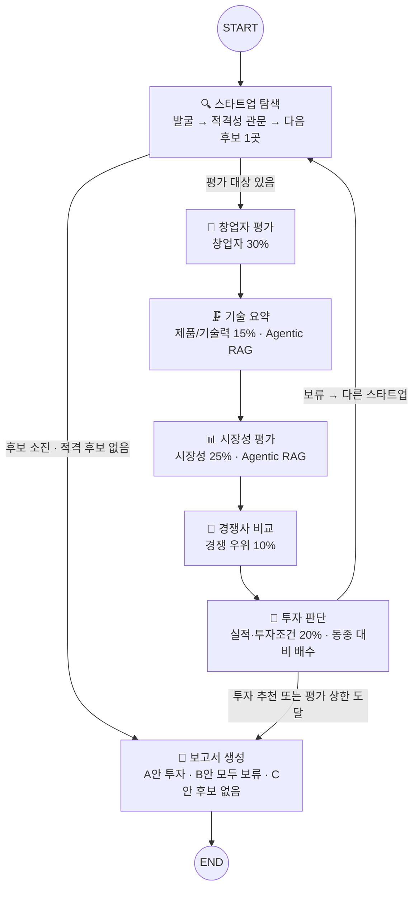
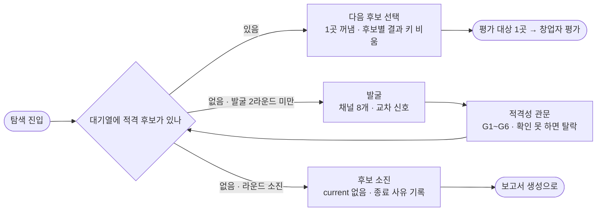
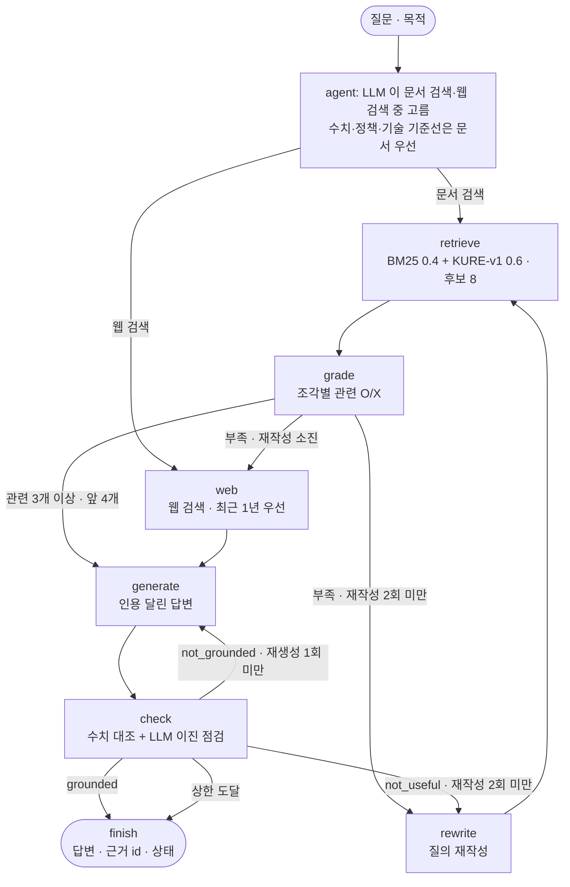

# AgTech AI 스타트업 투자 평가 에이전트 — 설계 산출물 v2

> SKALA 울산캠퍼스 2반 1조 · 김가연 · 김진녕 · 문지후 · 이준희 · 정승우 · 작성일 2026-09-30
>
> 장 순서는 과제 Deliverables 순서(A. Domain 선정 → B. 설계 → C. 투자판단 기준 → D. 그래프 설계 → E. 투자 보고서)를 그대로 따른다. 에이전트·도구·State·그래프 간선 표는 설계 상수(`docs/build_design.py`)에서, 평가 문항·문서 목록·실측 수치는 저장소 파일(`rubric.yaml`, `data/manifest.yaml`, `outputs/eval/`)에서 자동으로 채웠다.

## 목차

- **A. Domain 선정** — A.1 왜 AgTech 인가 · A.2 문제 정의
- **B. 설계** — B.1 에이전트 정의 · B.2 도구 정의 · B.3 스타트업 탐색 전략 · B.4 RAG 적용 대상과 문서 선정 · B.5 임베딩 모델 선정
- **C. 투자 판단 기준(평가표)** — C.1 두 표준의 역할 · C.2 판정 문항 · C.3 점수(동종 대비 배수) · C.4 결정 규칙 · C.5 Bessemer 10문 점검표 · C.6 뒤집힘 조건과 실사 항목 · C.7 ROI · C.8 사전 점검과 민감도
- **D. 그래프 설계** — D.1 State 설계 · D.2 메인 그래프(Workflow·Branch·Loop) · D.3 탐색 에이전트 내부 흐름 · D.4 Agentic RAG 서브그래프
- **E. 투자 보고서 목차(초안)** — A안 투자 추천 · B안 모두 보류 · C안 후보 없음
- **부록** — 1. 설계 요소와 코드 위치 · 2. 가이드 추적표

**v2 로 다시 설계한 이유 (한 줄)**: v1 은 '100점 만점에 확인된 YES 만 점수' 방식이라 평가한 10곳이 모두 보류였고, 실제 투자를 받은 양성 대조 기업 3곳 중 투자 추천도 0곳이었다. '모르는 회사'와 '나쁜 회사'를 가리지 못한 것이다. v2 는 ① 가이드 Graph(안)을 그대로 따르고 👤 창업자 평가를 더했고, ② 점수를 '투자를 받은 동종 기업 평균 = 100' 비교로 바꿨고(C.3), ③ Agentic RAG 에 인용 달린 답변 생성과 답변 점검을 넣었다(D.4).

**용어 정리**

| 용어 | 뜻 |
|---|---|
| 관문(Gate) | 평가 전에 과제의 스타트업 조건(비상장·Seed~Series C·Exit 전·AgTech AI)을 확인하는 통과/탈락 검사 |
| YES / NO / 미확인 | 문항 판정. YES·NO 는 근거 원문 인용이 있어야 하고, 근거를 못 찾으면 미확인(UNKNOWN). 미확인은 0점이 아니라 동종 기업 평균과 비교한다(C.3) |
| 동종 기준 집단 | 이번 실행에서 적격성 관문을 통과해 같은 파이프라인으로 평가한 후보들. Scorecard 의 '평균 기업 = 100%' 자리 |
| Scorecard 배수(M) | 6개 기준의 '동종 평균 대비 비율'을 비중대로 더한 값. 1.00 = 동종 평균(보고서 표기 100) |
| Deal-killer | 점수와 관계없이 보류시키는 조건(K1~K3) |
| 뒤집힘 조건 | 보류 후보의 미확인 문항 중 무엇이 확인되면 결론이 '투자 추천'으로 바뀌는지 |
| 실사 항목 | 공개 정보로 답하지 못해 투자 전에 회사에 직접 확인할 질문 |
| Agentic RAG | LLM 이 질문마다 어디서(문서/웹) 찾을지 고르고, 검색 결과와 답변을 스스로 점검하는 RAG |
| grounded / not_grounded / not_useful | Agentic RAG 답변 점검 결과: 근거로 뒷받침됨 / 근거에 없는 내용이 있음 / 질문에 답하지 못함 |
| Hit@K · MRR@K | Hit@K: 정답 조각이 검색 결과 앞 K개 안에 있는 질문의 비율. MRR@K: 정답 순위의 역수 평균(1위=1, 2위=0.5 …) |
| RRF | 여러 검색기의 순위를 합치는 방법(순위의 역수를 더함). 키워드 검색(BM25)과 의미 검색(Dense)을 섞을 때 쓴다 |
| Reducer | LangGraph State 에서 같은 키에 여러 번 쓸 때 덮어쓰지 않고 합치는 함수 |
| 재현용 캐시(replay/) | 검색 결과·LLM 응답을 저장해 두어, 다시 돌려도 같은 보고서가 나오게 하는 폴더 |

---

## A. Domain 선정 — 도메인과 문제 정의

### A.1 왜 AgTech 인가
| 근거 | 내용 |
|---|---|
| 시장·정책 | 「스마트농업 육성 및 지원에 관한 법률」(2024 시행)과 제1차 스마트농업 육성 기본계획(2025~2029)으로 정책 수요가 분명하다 |
| 투자 흐름 | 2025년 글로벌 애그리푸드테크 투자는 162억 달러로 전년과 비슷했고(-3%, 후기 투자자는 신중), 한국은 크게 늘었다(AgFunder 2026, 코퍼스 문서). 2~3년 전 과열 뒤 조정 국면이라 **옥석 가리기**가 더 중요하다 |
| 풀어야 할 문제 | 농가 고령화·인력난·기후 리스크로 자동화 수요가 크지만, 농가 ROI·다작기 실증·자본집약도 때문에 실패한 스타트업도 많다 → **'유망해 보이는 것'과 '투자할 만한 것'을 가르는 근거 기반 평가가 필요** |

### A.2 문제 정의
> **국내외 비상장 AgTech AI 스타트업(Seed~Series C, Exit 전)을 공개 정보로 발굴·검증하고, 투자를 받은 동종 기업의 평균과 비교해 투자 추천 여부를 가린 뒤, 임원이 30초 안에 '할까요, 말까요'를 정할 수 있는 5쪽 이내 보고서를 만든다.**

- **조정 국면을 전제로 한다.** 교수님도 과제 설명에서 이 시장이 2~3년 전에는 붐볐지만 지금은 주춤하다고 했다. 그래서 '유망해 보이는 기업'이 아니라 '투자를 받은 동종 기업보다 근거가 뚜렷이 앞서는 기업'을 고른다.
- **평가 범위**: AI·센서·로봇으로 농업 **생산성**을 높이는 기업. 가이드 도메인 문구 '작물 재배, 병해충 진단, 수확 등'에 맞춰 세부 분야를 5개로 나눴다.
  - `greenhouse` 스마트팜·시설원예 AI 환경제어
  - `diagnosis` 작물 생육·병해충 진단 AI
  - `robotics` 농업 로봇·자율주행 농기계
  - `livestock` 축산 AI(가축 건강·사양 관리)
  - `agdata` 농업 생산 데이터 분석·예측 AI (생육·환경 데이터)
- **스타트업 기준(과제 조건 그대로)**: 비상장(코스피·코스닥 제외) · 투자 단계 Seed~Series C · M&A 등 Exit 미완료. 가이드의 제외 예시(배달의민족 M&A Exit, 루닛·뷰노 코스닥 상장)는 관문 테스트에 넣었다.
- **조사 범위**: 국내외. 관문 검증 자리를 국내 12곳 + 해외 6곳으로 나눠 해외 후보가 순서에 밀려 빠지지 않게 한다.
- **산출물**: 주 경로는 투자 추천 기업의 평가 보고서(가이드 주제 '투자 가능한 스타트업에 대한 평가 보고서'). 모두 보류면 루프를 끝내고, 후보마다 '왜 안 되는지'와 '무엇이 확인되면 되는지'로 보고서를 만든다(E. B안).
- **성공 기준(측정)**: 검색기 Hit@4·MRR@4 · Agentic RAG 답변 Relevance·Faithfulness(이진) · 적격성 판정 정확도 · 결정 규칙의 합성 대조 테스트 · 보고서 형식 자동 검사(5쪽, SUMMARY 반쪽, REFERENCE 형식) · 새 clone 에서 API 키 없이 같은 보고서 재현

---

## B. 설계

### B.1 에이전트 정의
가이드의 에이전트 정의(안) 6개를 이름과 역할 그대로 두고, **하나만 더했다**. 가이드는 '설계 목적에 따라 추가/변경 가능'이라고 했고, 교수님도 추가·변경을 환영한다고 했다.

가이드 6개는 이름 그대로이고, **— 추가** 표시가 새로 넣은 에이전트다. 원칙은 **1 에이전트 = 1 Scorecard 기준 = 1 State 키**다. 에이전트마다 자기 기준의 근거를 모으고 판정까지 끝낸다. 교수님이 강조한 '한 에이전트가 한 가지 일을 완결적으로 끝내는' 구조다.

| 에이전트 (노드) | 한 가지 책임 | 판정하는 Scorecard 기준 | RAG | 주요 도구 | 쓰는 State 키 |
|---|---|---|---|---|---|
| 🔍 스타트업 탐색 (`discover`) | 평가할 **다음 적격 스타트업 1곳**을 정한다. 내부 3단계: 발굴 → 적격성 관문 G1~G6 → 다음 후보 선택 | — (평가 전 관문) | O — 문서 속 기관 선정 기업(교정형 검색) | 웹 검색, TIPS 목록·투자 기사 피드, 상장 목록 대조, 국민연금 사업장 | current, queue, screened, seen, raw_candidates, discovery_rounds, iterations, end_reason |
| 👤 창업자 평가 (`founder`) **— 추가** | 창업 시점(t0)을 먼저 고정하고, 창업 **전** 전문성과 창업 **후** 실행력을 나눠 판정 | 창업자 30% (F1~F4) | X — 사람에 관한 사실은 문서 코퍼스에 없음 | 웹 검색(인터뷰·기사), 기사 원문 수집, 국민연금 조회 결과(첫 고용·인원) | founder |
| 🗜️ 기술 요약 (`tech`) | 핵심 기술·장단점을 요약하고, 경쟁사 비교가 검증할 **차별점 주장**을 정리 | 제품/기술력 15% (P1~P4) | O — 분야 기술 기준선(논문·보고서) | 문서 요약(홈페이지·기사), Agentic RAG, 웹 검색 | tech |
| 📊 시장성 평가 (`market`) | 세부 분야의 시장 크기·성장·수요(실제 문제·지불 의향) | 시장성 25% (M1~M4) | **O (주 사용처)** — 하위 질문 3~6개마다 Agentic RAG | Agentic RAG, 웹 검색 | market, market_cache |
| 🥊 경쟁사 비교 (`competition`) | 같은 제품 유형의 국내외 경쟁사와 비교하고, 기술 요약의 차별점 주장을 검증 | 경쟁 우위 10% (C1~C4) | X (가이드 표 그대로) | 웹 검색, 기사 속 경쟁사 추출 | competition |
| 🧮 투자 판단 (`decide`) | 실적·투자조건을 판정하고 6개 기준을 **종합**(동종 대비 배수). 리스크(Deal-killer)·ROI·후보 리스트를 곁들여 **투자/보류** 결정 | 실적 10%·투자조건 10% (R1~R4, D1~D4) | X — 문항별 원문 인용 대조(RAG 아님) | 코드 규칙, 인용 검증 | scorecard, decision, evaluations, end_reason |
| 📝 보고서 생성 (`report`) | **단계별 결과를 장마다 연결**해 5쪽 이내 PDF를 만들고 형식을 검사. 새로 조사하지 않음 | — | X | 템플릿·PDF 렌더러·REFERENCE 포맷터 | report |

**가이드 안과 달라진 점**

1. **👤 창업자 평가 추가.** Scorecard 에서 비중이 가장 크다(30%). 교수님은 전 기수의 링크드인 팔로워 방식을 두고 "이 양반이 언제 창업했는지가 중요"하다고 짚으며 새로운 창업자 평가 아이디어를 요청했다. 그래서 기술 요약은 기술만, 창업자 평가는 사람만 맡는다.
2. **탐색은 에이전트 하나, 안에 3단계.** 발굴(많이 찾기)과 적격성 관문(정확히 거르기)은 탐색 에이전트 안의 단계다. 메인 그래프에서는 Graph(안)처럼 한 노드이고, 보류되면 이 노드로 돌아온다.
3. **실적·투자조건은 투자 판단이 직접 판정한다.** 가이드 역할 '종합 판단(리스트, ROI 등)'에 맞춰 재무·거래 조건과 6개 기준의 종합을 한곳에서 책임진다.

### B.2 도구 정의
실습 목표 두 번째 줄이 **'외부 정보 검색, 문서 요약 등의 목적에 맞는 도구 정의'**다. 도구는 두 종류로 나눴다.

- **LLM 이 상황에 따라 고르는 도구**: LangChain `@tool` 로 정의해 이름·입력·설명(용도·한계·최신성)을 LLM 에 준다. Agentic RAG 안에서 LLM 이 **문서 검색·웹 검색 중 고른다**(D.4).
- **매번 같은 답이 나와야 하는 사실 확인**: 결정적 함수로 두고 코드가 부른다.
- 문서 요약(`summarize_document`)은 `@tool` 로 정의하되, 요약할 대상(회사 홈페이지·기사)이 정해져 있어 기술 요약 에이전트 코드가 부른다.

| 도구 | 가이드 목적 | 종류 | 누가 쓰나 | 외부 키 |
|---|---|---|---|---|
| `search_documents(query)` | PDF 자료 기반 정보 추출 | @tool — Agentic RAG 안에서 LLM 이 고름 | 기술 요약·시장성 (Agentic RAG) | 없음 (로컬 KURE-v1·FAISS·Kiwi BM25) |
| `web_search(query, recent)` | 외부 정보 검색 | @tool — Agentic RAG 안에서 LLM 이 고름. 에이전트 코드도 직접 호출 | 탐색·창업자·기술·시장성·경쟁사 | Serper·Tavily (재현 때는 캐시) |
| `summarize_document(source, focus)` | 문서 요약 | @tool 로 정의, 코드가 호출 | 기술 요약: 회사 홈페이지·기사 → 핵심 기술·장단점 (홈페이지를 못 읽으면 수집한 기사 본문) | OpenAI (gpt-4.1-mini) |
| 상장 목록 대조 (KRX KIND) | 스타트업 기준 '비상장' | 결정적 함수 | 탐색(관문 G1) | 없음 |
| 국민연금 사업장 조회 | 창업 시점(첫 고용)·인원·탈퇴 | 결정적 함수 | 탐색(관문 G4)에서 조회, 창업자 평가가 t0·고용 추이에 사용 | 없음 |
| TIPS 목록 · 투자 기사 피드 | 발굴 채널 | 결정적 함수 | 탐색(발굴) | 없음 |
| 기사 원문 수집 | 근거 본문·게시일 확보 | 결정적 함수 | 탐색(관문 근거 보강), 창업자·기술(기사 본문 발췌) | 없음 |

- **최신성**: `web_search` 는 `recent=True`(최근 1년 우선)가 기본값이다. 교수님은 프롬프트를 대충 쓰면 옛날 자료가 올라온다고 경고했다. 사건 날짜가 24개월 안인지는 코드가 다시 검사한다.

### B.3 스타트업 탐색 전략
**🔍 탐색 에이전트 내부 3단계(발굴 → 적격성 관문 → 다음 후보 선택)** — 그림은 D.3.

- 대기열에 적격 후보가 남아 있으면 발굴 없이 바로 다음 후보를 꺼낸다.
- 대기열이 비면 검색 표현을 바꿔 다시 발굴한다(최대 2라운드). 그래도 없으면 '후보 소진'으로 보고서 단계에 넘긴다.
- 발굴·관문 코드는 v1 에서 정확도를 잰 것을 그대로 쓴다(아래 '적격성 검증 정확도').

**창업자(링크드인) 검색으로 발굴하지 않는다.** 교수님 지적대로 링크드인 팔로워 같은 지표는 가입한 날부터 쌓여 **창업 시점과 맞지 않는다.** 사람의 경력은 회사의 창업 시기·투자 단계·상장 여부도 알려 주지 않고, 로그인·약관 문제로 재현도 안 된다. 대신 **회사에 일어난 '날짜가 찍힌 공개 사건'**을 모은다.

**창업자 평가도 창업 시점에 맞춘다**: ① 창업 시점(t0)을 먼저 고정한다 — TIPS 공개 목록의 설립일 → 국민연금 사업장 최초 가입일(첫 고용) → 적격성 검증의 설립연도(같은 연도의 원문 설립 표현이 있으면 그 근거를 붙임) → 근거 속 가장 이른 설립 표현 순. 어느 값을 썼는지 보고서에 적는다. ② 창업 **이전** 경력만 전문성(F1)으로 인정한다. ③ 창업 **이후** 성과는 날짜가 찍힌 사건(수상·선정·투자·출시)만, 평가일 기준 24개월 안의 것만 실행력(F3)으로 인정한다.

| 채널 | 무엇을 주나 | 왜 유효한가 |
|---|---|---|
| T. TIPS 창업기업 공개 목록 | 설립일·선정연도·운영사 | TIPS 는 운영사가 먼저 투자해야 선정 → **Seed 급 투자 이력 보장** |
| W. 투자 기사 피드 (와우테일 애그테크) | 투자 유치 기사, 정확한 게시일 | 라운드 자체가 기사화됨 |
| A. 투자 유치 뉴스 (세부 분야 5개) | 시드·시리즈 라운드 | 단계·시점이 함께 잡힘 |
| B. 공공 선정 (A-벤처스, 스마트농업 우수기업) | 정부가 검증한 기업 | 초기 기업 풀 |
| C. 스타트업 DB 스니펫 | 설립일·투자 단계 | 직접 크롤링은 하지 않음(robots·차단 정책 준수) |
| D. 수상·전시, E. 문서 RAG, F. 해외 투자 뉴스 | 보완 채널 | 국내가 부족할 때 확장 |
| **국민연금 가입 사업장 내역** (공공데이터, 키 불필요) | 최초 가입일·가입자 수·탈퇴 여부 | 창업자가 아니라 **회사의 창업(첫 고용) 시기와 실제 인원**을 제3자 공공자료로 확인. 탈퇴면 폐업·휴업 신호(G4) |
| **기사 원문 수집** (키 불필요) | 근거 기사의 본문과 원문 게시일 | 검색 스니펫에 없는 창업자 이력·실적·계약을 확보하고, 게시일을 원문 메타데이터로 바로잡음 |

- **교차 신호**: 서로 다른 채널에서 함께 잡힌 후보일수록 실재하고 활발한 기업 → 우선순위를 올린다.
- **관문(적격성 검증)**: G1 비상장(한국거래소 KIND 상장 목록과 코드로 대조) · G2 Seed~Series C(인용문에 '회사명+단계'가 함께 있을 때만) · G3 Exit 없음 · G4 반증 검색(폐업·회생·구조조정) + 국민연금 사업장 탈퇴 여부 · G5 분야(**AI 가 핵심이고 농업 생산성 기술일 때만**, 유통·중개·수산 양식·식품 가공 제외) · G6 **회사명이 나오는** 근거 3곳 이상·제3자 1곳 이상
- **확인 못 하면 통과시키지 않는다(fail-closed)**: 상장 목록을 못 불러오거나 검증·반증 검색이 실패하면 '확인 불가'로 탈락시키고, 보고서 한계점에 회사별로 적는다.
- **루프**: 투자 판단이 보류면 메인 그래프가 이 에이전트로 돌아와 다음 후보를 받는다(Graph(안)의 E→A). 상한은 발굴 2라운드, 심층 평가 10곳이다. 10곳은 반 공용 API 키의 비용 상한이자, 교수님이 모든 루프에 두라고 한 '최대 반복 횟수'다. 상한 때문에 평가하지 못한 적격 후보는 보고서에 이름과 함께 밝힌다.

**적격성 검증 정확도**: 정답 라벨은 공개 기사·기업 DB 를 근거로 만들었고 줄마다 근거 문장을 적어 두었다(`data/eval/eligibility_*.jsonl`). 사람의 독립 검수는 하지 않았다. 지표는 적격/부적격(이진) 정확도다. 아래 표의 v1~v5 는 적격성 관문 자체의 개선 버전이다.

| 버전 | 바꾼 점 | 정확도 | 정밀도 | 재현율 | 주요 오류 |
|---|---|---|---|---|---|
| v1 | 투자 뉴스 스니펫만으로 판정, AI·AgTech 여부를 true/false 로 강제 | 0.50 | 0.67 | 0.18 | 투자 기사에 AI 설명이 없다는 이유로 "AI 핵심 아님" 탈락 5건, 요약 기사에서 다른 회사의 "Pre-IPO"를 가져옴 |
| v2 | AI·AgTech 여부 3가지 값(YES/NO/UNKNOWN), 단계 인용문 요구, 투자 검색 강화(advanced) | 0.75 | 0.80 | 0.73 | 올바른 인용문도 완전 일치가 아니라 거부(제목+본문 혼합), 폐업·인수 누락 |
| v3 | 인용문 3-gram 80% 일치 + 같은 근거에 회사명·단계 표현 동시 존재 확인 | 0.90 | 0.85 | 1.00 | 과거 폐업(Iron Ox)·지분 인수(유라이크코리아)를 못 찾음 |
| v4 | 인수·폐업 검색을 news → general 로 변경 (news 색인은 최근 기사 위주, 실측) | **1.00** | **1.00** | **1.00** | 없음 (단, 같은 20개사로 고쳤으므로 과적합 가능성 있음) |
| v5 (현재) | 검증 검색 실패 시 탈락(fail-closed), G5 는 AI·농업 생산성 모두 YES 일 때만, G6 는 회사명이 나오는 근거만, 국민연금·기사 원문 근거 추가 | 0.95 | 1.00 | 0.91 | Agtonomy(독립 스타트업)를 "대기업 계열"로 잘못 탈락. 홀드아웃 10개사는 1.00 |

- 개선에 쓴 20개사 정확도 0.95, 개선에 쓰지 않은 10개사(홀드아웃, 해외 기업) 정확도 1.00. 발굴·관문 코드는 v2 에서 바꾸지 않으므로 이 수치가 그대로 유효하다.

### B.4 RAG 적용 대상과 문서 선정 전략
**적용 대상 = 가이드 표에서 RAG 'O'인 세 에이전트 모두.** 'X'인 경쟁사·투자 판단·보고서와 새로 넣은 창업자 평가는 벡터 검색을 쓰지 않는다. 가이드는 'O 중 최소 1개'를 요구하는데, 표의 O/X 를 그대로 따르는 것이 'RAG 적용 에이전트 선정이 적절한지'에 대한 우리 답이다. 투자 판단이 문항마다 후보가 모은 근거에서 원문 인용을 찾는 것은 RAG 가 아니라 **인용 대조**라고 부른다.

| 에이전트 | 묻는 질문 | 방식 | 이유 |
|---|---|---|---|
| 🔍 탐색 | 기관이 선정·평가한 국내외 AgTech 기업과 투자 사례(기업명 포함) | 교정형 검색만(검색 → 이진 채점 → 재작성 → 웹 보완). 답변 생성 없음 | 목적이 기업명 추출이라 조각을 LLM 개체 추출에 넘긴다 |
| 🗜️ 기술 요약 | {세부 분야}의 기술 성숙도·상용화 수준·기술적 과제 | Agentic RAG(D.4) → 인용 달린 기준선 답변 | 가이드 문구 '홈페이지, 논문 등에서 핵심 기술, 장단점' 중 '논문' 부분 |
| 📊 시장성 | 시장 크기·성장률·수요/지불 의향·정책·도입 장벽·투자 사이클 | 질문을 하위 질문 3~6개로 분해 → 하위 질문마다 Agentic RAG | 시장 수치는 공신력 있는 문서가 필요하고, 웹에는 유료 시장조사 홍보 수치가 섞인다 |

**Agentic RAG 답변 품질(LLM-as-a-Judge, 이진 판정)**: v1 측정값 Relevance 1.00 · Faithfulness 0.95 · Correctness 0.95 (질문 20개). v2 서브그래프(답변 생성·점검 추가)로 다시 잰다. Generator·Judge 모두 `gpt-4.1-mini` 라(공용 키 비용 때문에 mini 등급) 자기 답을 후하게 볼 수 있다. 그래서 평가표 판정은 **인용문이 실제 원문에 있는지 코드로 검사**하고, 적격성은 정답 라벨과 대조해 보완한다.

**문서 선정 원칙**: ① 공공기관·연구기관·동료심사 논문 — 예외로 **AgFunder 2026(민간 투자 리포트, 65쪽)**을 넣었다. 글로벌·국가별·단계별 AgTech 투자 추이를 연 단위로 주는 공개 자료가 이것뿐이다 ② 2023년 이후 ③ 최종본만, **발췌 없이 문서 전체** ④ 평가 후보가 몰린 세부 분야(로봇·시설원예·축산)에 기술·사업성 문서 배치 ⑤ 이해상충 문서 제외(평가 후보 기업 소속 연구소장이 쓴 보고서)

**웹 검색 기간 규칙**: 투자·실적·경쟁 뉴스는 최근 1년을 먼저 찾고 부족하면 기간 제한을 푼다. 설립·인수·폐업처럼 과거 사건 확인은 기간 제한 없이 찾는다. 평가 문항은 사건 날짜로 다시 거른다(실적·투자·시장 성장 문항은 평가일 기준 24개월).

| 문서 | 발행 | 연도 | 쪽 | 역할 |
|---|---|---|---|---|
| 제1차 스마트농업 육성 기본계획(2025~2029년) | 농림축산식품부 | 2025 | 43 | 정책 목표·지원 제도·시장 수치·진입 장벽 |
| 스마트 농업과 농업 부문 고용 현황 및 전망 | 한국농촌경제연구원 | 2024 | 16 | 기관별 스마트농업 시장 추정치 비교 |
| 애그테크, 선택 아닌 필수 - 주요국의 애그테크 산업 정책 동향을 중심으로 | KDI 경제교육·정보센터 | 2023 | 18 | 세계·국내 애그테크 시장, 주요국 정책 |
| 기술력과 현장 확산 성과를 갖춘 스마트농업 우수기업 15개사 최초 선정 | 농림축산식품부 | 2026 | 2 | 스타트업 발굴 시드(정부 선정 기업) |
| 농식품 분야 우수 벤처창업 기업 정보가 한 곳에 | 농림축산식품부 | 2024 | 2 | 스타트업 발굴 시드(이달의 A-벤처스) |
| 농식품 모태펀드, 2026년 신산업 투자 본격 확대 | 농림축산식품부 | 2026 | 2 | 국내 농식품 벤처 투자 자금 흐름 |
| 「스마트농업 육성 및 지원에 관한 법률」 제정의 의의와 향후 과제 | 국회입법조사처 | 2023 | 4 | 규제 프레임(스마트농업법) |
| '스마트농업 데이터 AX활용' 본격 추진 | 농림축산식품부 | 2026 | 3 | 2026 농업 AI 정책·데이터 인프라 |
| Global AgriFoodTech Investment Report 2026 | AgFunder | 2026 | 65 | 분야별 글로벌 투자 동향(국가별·단계별) |
| Precision Agriculture in the Digital Era: Recent Adoption on U.S. Farms (Report Summary) | USDA Economic Research Service | 2023 | 2 | 정밀농업 도입률·도입 장벽 |
| Precision Dairy Farming, Robotic Milking, and Profitability in the United States (Report Summary) | USDA Economic Research Service | 2026 | 2 | 축산 로봇·정밀 낙농 수익성 |
| Agricultural Robotics: A Technical Review Addressing Challenges in Sustainable Crop Production | MDPI | 2025 | 26 | 농업 로봇 기술 성숙도·확산 장벽 (로봇 후보 기준선) |
| Vertical farming economics: crop performance targets for cost-competitive vertical farming | Frontiers | 2026 | 11 | 수직농장·시설원예 사업성 리스크 (CEA 후보 기준선) |
| **합계** | | | **196** | 과제 한도 200쪽 |

**선정 과정 (후보 45개, 2,031쪽 → 13개, 196쪽)**: 공공·국제기구 공개 PDF 45개(국문 21·영문 24)를 내려받아 텍스트 추출 여부와 쪽수를 확인한 뒤 아래 이유로 뺐다.

| 제외 사유 | 대표 문서 |
|---|---|
| 200쪽 한도에 비해 너무 김 (발췌 대신 전체 사용 원칙) | KREI 미래농업 신성장 산업(209쪽), FCDO AI 농식품 리뷰(188쪽), World Bank AI 보고서(102쪽), JRC 디지털화(105쪽) |
| 이해상충 | IPET 무인 농작업 협업 기술 — 평가 후보 기업(긴트) 연구소장이 집필 |
| 오래됨 (2022년 이전) · 내용 중복 | FAO-ITU AI in Agriculture(2021), AgFunder 2025(2026판과 중복), 요약본이 있는 원문 |
| 평가 대상과 거리가 멂 | 식품테크 투자(Dealroom), 인도 농업 AI(WEF), 드론·유통 심층 보고서 |
| 수치 출처 문제 | 같은 시장 수치를 다른 시장으로 옮겨 적은 보고서 (IPET 축산 AX: 스마트농업 전체 시장 수치를 축산 시장으로 인용) |

| 에이전트 질문 | 대응 문서 |
|---|---|
| 국내 시장 규모·기관별 추정치 | KREI 스마트농업과 고용, KDI 애그테크 리뷰, 농식품부 기본계획 |
| 글로벌 시장·투자 동향(단계별 투자금 포함) | AgFunder 2026, KDI 애그테크 리뷰 |
| 정책·규제 | 농식품부 기본계획, 국회입법조사처 스마트농업법, 데이터 AX 보도자료 |
| 도입 장벽·수익성 | USDA 정밀농업 도입, USDA 로봇 착유 수익성, 수직농장 경제성 논문 |
| 기술 기준선 | 농업 로봇 기술 리뷰(로봇·수확), 수직농장 경제성(시설원예), USDA 로봇 착유(축산) |
| 스타트업 발굴 시드 | 스마트농업 우수기업 15개사, A-벤처스 60개사, 농식품 모태펀드 |

- **빈 칸**: 병해충 진단·농업 데이터 분야의 기술 기준선 문서는 200쪽 한도 때문에 넣지 못했다(해당 분야 후보는 웹 근거로 평가).
- 교수님 말씀대로 많은 데이터를 벡터DB 에 넣는다고 좋은 결과가 나오지 않는다. 그래서 196쪽을 에이전트 질문에 맞춰 골랐고, 검색 범위를 넓히는 대신 질문마다 문서·웹을 고르게 했다(D.4).
- **전처리**(실습에서 겪은 오류 반영): 매 페이지 머리글·바닥글 제거 · **출처·각주 줄을 본문에서 분리**(출처 줄의 날짜를 사건 날짜로 오인한 경험) · 2단 편집은 단 순서로 읽기 · 표는 캡션과 묶어 별도 조각 · 참고문헌 페이지 제외 · 조각 800자 / 겹침 100자
- **검색**: Kiwi 형태소 BM25 0.4 + Dense 0.6 (RRF) → 검색기마다 후보 8개 → Judge LLM 관련성 O/X → 검색 순위대로 앞 4개 (가중치·방식은 B.5 실측으로 결정)

### B.5 임베딩 모델 선정 (후보·기준·실측)
**리더보드 순위로 고르지 않았다.** 가이드도 '리더보드 상위 랭크'는 적절한 선택 이유가 아니라고 했다. 공개 한국어 검색 벤치마크에서 상위 모델 간 차이는 nDCG@10 1.5%p 이내라(KURE 공개 벤치마크) 문서 종류에 따라 순위가 바뀔 수 있다. 그래서 **우리 문서로 만든 질문 70개를 실제 파이프라인 설정 그대로** 재서 골랐다.

**경제성(과제 문구의 첫 단어)**: 후보 모두 오픈소스이고 노트북 CPU 에서 돌아 임베딩 API 비용은 0원이다. 문서 임베딩은 한 번만 계산해 캐시하고 질의 임베딩도 캐시하므로 재실행·재현에 추가 비용이 없다.

| 후보 기준 | 이유 | 판정 |
|---|---|---|
| C1 한·영 혼용 | 한국 보고서 + 영문 보고서 코퍼스 | 한국어 검색 학습 또는 다국어 검색 학습 |
| C2 최대 길이 ≥ 조각 길이 | 800자 한국어 조각은 최대 약 700토큰 | 128토큰 모델은 100% 잘려 제외 |
| C3 노트북 재현성 | 팀원 노트북, GPU 없음 | GPU 없이 동작, 문서 임베딩은 한 번만 계산해 캐시 |
| C4 라이선스 | 오픈소스 조건, 결과 공개 | MIT/Apache 명시 (미기재 모델 제외) |
| C5 입력 규칙 위험 | 접두어를 빠뜨리면 조용히 성능 저하 | 규칙을 설정 파일에 명시 |

**최종 비교 후보 6개**: bge-m3(다국어 기준선) · KURE-v1(bge-m3 한국어 미세조정) · snowflake-arctic-embed-l-v2.0-ko(한국어 미세조정) · multilingual-e5-large(평균 풀링 계열 대조군) · Qwen3-Embedding-0.6B(디코더 기반 대안) · multilingual-e5-small(저사양 대안). 제외: ko-sroberta·MiniLM(128토큰 한계, 검색용 아님), upskyy/bge-m3-korean(라이선스 미기재), BGE-m3-ko(KURE 와 같은 가설·학습 데이터 미기재).

**1차 실측 (임베딩 6종 × 검색 방식, 질문 70개 = 자연어형 40 + 키워드형 30, 정답 = 같은 문서·페이지)**

| retriever      | embedding                        |   Hit@1 |   Hit@3 |   Hit@5 |   MRR@5 |
|:---------------|:---------------------------------|--------:|--------:|--------:|--------:|
| Dense          | nlpai-lab/KURE-v1                |   0.8   |   0.938 |   0.971 |   0.868 |
| Dense          | snowflake-arctic-embed-l-v2.0-ko |   0.771 |   0.954 |   0.971 |   0.864 |
| Dense          | BAAI/bge-m3                      |   0.734 |   0.929 |   0.958 |   0.831 |
| Dense          | Qwen/Qwen3-Embedding-0.6B        |   0.704 |   0.904 |   0.942 |   0.803 |
| Dense          | multilingual-e5-large            |   0.684 |   0.85  |   0.866 |   0.763 |
| Kiwi BM25      | -                                |   0.6   |   0.675 |   0.721 |   0.644 |
| Hybrid 0.5:0.5 | multilingual-e5-small            |   0.542 |   0.729 |   0.729 |   0.624 |

임베딩마다 가장 좋은 검색 방식 한 줄씩 보였다(전체 19개 조합은 `outputs/eval/retrieval_eval.md`).

**2차: 실제 파이프라인 설정으로 다시 재서 결정**

처음에는 "Judge LLM 이 후보 8개를 다시 거르니 순위보다 8개 안 적중(Hit@8)이 중요하다"고 보고 snowflake-arctic-ko + 하이브리드 0.3:0.7 을 골랐다. 그런데 코드는 관련 판정을 받은 조각을 **검색 순서대로 앞 4개만** 쓴다. 그래서 측정 기준을 실제 동작에 맞춰 **Hit@4(앞 4개 안 적중)와 MRR@4** 로 바꾸고, 측정 전에 규칙을 정했다(`eval/eval_final_retriever.py` 머리말).

1. 전체 Hit@4 가 가장 높은 설정
2. 같으면 MRR@4 가 높은 설정
3. 다른 임베딩이 1위여도, 지금 쓰는 임베딩의 최고 설정이 두 지표 모두 0.01 이내면 재색인이 필요 없는 쪽

- 결과: **KURE-v1 + 하이브리드 0.4:0.6** 이 Hit@4 0.986(70문항 중 69), MRR@4 0.833 으로 1위다. 처음 고른 설정은 Hit@4 0.943 으로 3문항을 더 놓쳤다. 재색인 없이 가능한 최고(snowflake Dense 단독, Hit@4 0.971)는 규칙 3의 0.01 범위 밖이라 임베딩을 바꿨다.
- 가중치 민감도: KURE-v1 하이브리드는 BM25 0.1~0.4 에서 Hit@4 가 모두 0.986 이고 MRR@4 차이도 0.013 이내다. 가중치 하나에 기대는 결과가 아니다. 0.5:0.5 는 영어 문서의 1위 적중이 0.148 로 떨어져 가장 나빴다. 가중치보다 임베딩 선택의 효과가 컸다.
- 하이브리드를 쓰는 이유: 같은 KURE-v1 에서 Dense 단독은 Hit@4 0.943 이다. 키워드 검색(BM25)이 회사명·정책명 같은 정확한 용어가 들어간 키워드형 질문을 보완한다(키워드형 Hit@4 0.900 → 1.000).
- 한계: 질문 70개라 1문항 차이가 0.014 다. 차이가 작으므로 검색 평가 질문을 늘리는 것이 다음 과제다. 질문은 LLM 으로 만든 뒤 LLM 으로 걸렀고 사람이 전수 검수하지는 않았다.
- 기록 시점: 위 표와 규칙 적용은 선택 전 설정(snowflake 0.3:0.7)으로 잰 결과다(`outputs/eval/runtime_retriever.json`). 설정을 KURE-v1 0.4:0.6 으로 바꾼 뒤 `eval/eval_final_retriever.py` 를 다시 돌려 선택한 설정의 수치(Hit@4 0.986, MRR@4 0.833)가 그대로 나오는 것을 확인했다.

| 설정 (후보 8개) | Hit@1 | Hit@3 | **Hit@4** | **MRR@4** | Hit@8 | 한국어 문서 Hit@4 | 영어 문서 Hit@4 |
|---|---|---|---|---|---|---|---|
| snowflake + 하이브리드 0.3:0.7 (처음 선택) | 0.700 | 0.929 | 0.943 | 0.808 | 0.971 | 1.000 | 0.852 |
| snowflake Dense | 0.771 | 0.957 | 0.971 | 0.865 | 0.971 | 1.000 | 0.926 |
| snowflake + 하이브리드 0.5:0.5 | 0.586 | 0.900 | 0.929 | 0.736 | 0.986 | 1.000 | 0.815 |
| KURE-v1 Dense | 0.800 | 0.943 | 0.943 | 0.864 | 0.986 | 0.953 | 0.926 |
| KURE-v1 + 하이브리드 0.3:0.7 | 0.700 | 0.957 | 0.986 | 0.826 | 0.986 | 1.000 | 0.963 |
| **KURE-v1 + 하이브리드 0.4:0.6 (선택)** | 0.714 | 0.957 | 0.986 | 0.833 | 0.986 | 1.000 | 0.963 |
| KURE-v1 + 하이브리드 0.5:0.5 | 0.586 | 0.929 | 0.957 | 0.752 | 0.986 | 1.000 | 0.889 |
| Kiwi BM25 단독 | 0.586 | 0.657 | 0.686 | 0.624 | 0.700 | 0.953 | 0.259 |

질문 70개 기준이며 1문항 = 0.014. 한국어/영어는 정답 문서의 언어다(질문은 모두 한국어).

**적용 전략**: 질의·문서 모두 접두어 없음(설정에 명시)·벡터 정규화 · 조각 800자 / 겹침 100자(약 12%, 교수님 권고 약 10%) · Kiwi BM25 0.4 + Dense 0.6(RRF) · 검색기마다 후보 8개 → Judge 이진 관련성 → 앞 4개(교수님 권고 top-k 3~5). 리랭커·ParentDocument 는 넣지 않았다. 이 설정의 Hit@4 가 0.986(70문항 중 69)이라 개선 여지가 1문항이고, '넣으면 얼마나 좋아지는지 먼저 재야 한다'는 원칙 때문이다.

**선정**: `nlpai-lab/KURE-v1` + 하이브리드(Kiwi BM25 0.4 : Dense 0.6). MIT 라이선스, 최대 8,192토큰(조각 800자보다 충분히 김), 질의 접두어 없음.

---

## C. 투자 판단 기준 (평가표)

### C.1 두 표준의 역할 — 무엇을 묻고, 어떻게 합칠까
가이드가 준 두 방법을 섞어 쓴다. 교수님은 둘 중 하나를 골라도, 섞어도 되며 평가표를 잘 설계해 코드로 옮기라고 했다.

| 표준 | 맡는 일 | 코드 |
|---|---|---|
| **Scorecard** (가이드 표 + Bill Payne) | **어떻게 합칠까.** 가이드 표의 6개 기준·가중치(창업자 30·시장성 25·제품/기술력 15·경쟁 우위 10·실적 10·투자조건 10) + Payne Scorecard 의 **'평균 기업 = 100%' 비교 원리** | `agents/decision.py` |
| **Bessemer 체크리스트 10문** | **무엇을 물을까.** 24개 판정 문항의 출처이자, 보고서의 10문 점검표 | `rubric.yaml` |

- Payne 원 방법(ACA 2019)은 요인이 7개이고 가중치도 다르다. 우리는 가이드 표의 6개 기준·가중치를 그대로 쓰고, 원 방법에서는 '투자를 받은 평균 기업과 비교한다'는 원리만 가져왔다.
- 기준 안의 세부 문항에는 AgTech 투자에서 반복되는 실패 요인(농가 ROI·다작기 실증·인허가·자본집약도·보조금 의존)을 넣었다. 근거는 코퍼스 문서(USDA 정밀농업 도입·로봇 착유 수익성, 수직농장 경제성 논문, 스마트농업 기본계획)다.

### C.2 판정 문항 (24개, 이진 판정)
**판정 방식**: 1~5점 척도 대신 **YES / NO / 미확인**을 쓴다(N/A 는 인허가 문항만). 교수님은 애매하면 이진(바이너리)으로 판정하라고 했고, 척도 기반 판정은 신중해야 한다고 했다. 척도(배수)는 C.3 공식으로 코드가 만든다.

- YES 는 근거 원문 인용이 있어야 하고, **코드가 인용문이 실제 근거 본문에 있는지 검사**한다(실패하면 미확인).
- NO 도 반대 사실을 적은 문장의 인용이 있어야 한다. '근거가 없다'는 NO 가 아니라 미확인이다(없음과 반대를 구분).
- 회사 고유 문항은 인용 앞뒤 300자 안에 **회사명**이, 성능·경제성 문항은 **제3자 근거**가(대표 발언·회사 계획은 제3자 근거가 아님), 실적·투자·시장 성장 문항은 **최근 24개월** 근거가 있어야 한다.
- '상용화 예정·실증·시범 운영'은 상용 운영이 아니다. 투자 금액이 '비공개'면 라운드 문항(D1)을 인정하지 않는다.
- LLM 에는 점수·기준점을 보여 주지 않고, **기준마다 따로** 판정시킨다(후광 효과 방지).
- **각 기준은 그 기준을 맡은 에이전트가 자기 단계까지 모인 근거로 판정한다(실적·투자조건과 빠진 기준은 투자 판단이 판정).** 판정 코드와 프롬프트는 한 곳(`core/judge.py`)에 있다.

**가이드 평가 포인트 ↔ 문항 ↔ 담당 에이전트**

| Scorecard 기준(비중) | 가이드 '평가 포인트' | 문항 | 담당 |
|---|---|---|---|
| 창업자 30 | 전문성 / 커뮤니케이션 / 실행력 | F1·F2 / F4 / F3 | 👤 창업자 평가 |
| 시장성 25 | 시장 크기 / 성장 가능성 (+ 가이드 시장성 에이전트 역할의 '수요') | M1 / M2 / M3·M4 | 📊 시장성 평가 |
| 제품/기술력 15 | 독창성 / 구현 가능성 | P3 / P1·P2·P4 | 🗜️ 기술 요약 |
| 경쟁 우위 10 | 진입장벽 / 특허 / 네트워크 효과 | C2·C4 / C1 / C3 | 🥊 경쟁사 비교 |
| 실적 10 | 매출 / 계약 / 유저수 | R1·R4 / R3 / R2 | 🧮 투자 판단 |
| 투자조건 10 | Valuation / 지분율 등 | D1·D3 / D2·D3·D4 | 🧮 투자 판단 |

- **커뮤니케이션 ↔ F4 대리지표: 회사가 대외에 발표한 수치가 제3자 자료로도 확인되는가.** 공개 정보로는 대화 능력을 잴 수 없어, 투자자·고객에게 한 말이 사실로 뒷받침되는지로 대신 본다.
- 가이드 역할 '종합 판단(리스트, ROI 등)'과 Bessemer 의 '큰 기회'는 C.4·C.7 에서 다룬다.

**창업자·팀 (Owner) — 비중 30% · 담당 👤 창업자 평가**

| ID | 평가 포인트 | 질문 | YES 요건 | Bessemer |
|---|---|---|---|---|
| F1 | 전문성 | 창업자나 경영진이 창업 이전부터 농업 현장이나 해당 기술 분야에서 연구·실무·사업 경험을 쌓았는가? (농학·축산·수의·원예 전공, 관련 연구·실무, 이전 창업 등) | 이름과 경력이 함께 적힌 근거 | Q5, Q10 |
| F2 | 전문성(기술 역량) | 핵심 기술(AI·로봇·센서) 책임자의 기술 이력(특허 발명자, 논문, 연구소·기업 경력)이 확인되는가? | 기술 책임자 개인의 특허·논문·연구·경력이 적힌 근거 (회사 기술 소개나 출신 학교만으로는 부족) | Q5 |
| F3 | 실행력 | 최근 24개월 안에 공개된 마일스톤(제품 출시, 현장 설치, 인증, 정부 과제·TIPS 선정, 후속 투자)이 2건 이상 있는가? | 날짜가 있는 마일스톤 근거 2개 이상 (투자 유치·수상·정부 선정·혁신상·우수기업 선정·출시·인증) | Q10 |
| F4 | 커뮤니케이션(대리지표: 대외 발표 수치의 제3자 확인) | 회사가 공개한 핵심 수치(고객 수·성능·매출 등)가 제3자 근거로도 확인되는가? 서로 모순되는 근거가 있으면 NO | 같은 수치를 확인한 제3자 근거 (모순 근거가 있을 때만 NO) | Q5 |

**시장성 (Opportunity Size) — 비중 25% · 담당 📊 시장성 평가**

| ID | 평가 포인트 | 질문 | YES 요건 | Bessemer |
|---|---|---|---|---|
| M1 | 시장 크기 | 목표 시장(해당 세부 분야 또는 스마트농업·애그테크 시장)의 규모가 공공기관·국제기구·연구기관 문서에서 수치와 기준 연도로 확인되는가? | 문서 코퍼스 근거([D...]) 필수 | Q1 |
| M2 | 성장 가능성 | 해당 분야가 성장 중이라는 최근 근거(투자액·도입률·정책 예산 증가)가 있는가? | 발행 연도가 있는 수치 (평가일 기준 최근 2년 안에 발행된 근거) | Q8 |
| M3 | 수요(실제 문제 해결) | 고객의 실제 문제와 제품의 경제적 효과(비용 절감, 수확량 증가, 노동 절감)가 수치로 제시되고 제3자 근거가 있는가? | 제3자 출처의 효과 수치 | Q2 |
| M4 | 수요(지불 이유·수익 모델) | 누가 돈을 내는지와 과금 방식(장비 판매, 구독, 서비스, 수수료, 공공 조달)이 확인되는가? | 과금 방식을 서술한 근거 | Q3, Q7 |

**제품/기술력 — 비중 15% · 담당 🗜️ 기술 요약**

| ID | 평가 포인트 | 질문 | YES 요건 | Bessemer |
|---|---|---|---|---|
| P1 | 구현 가능성(상용 운영) | 시제품 단계를 지나 실제 농장·온실·축사에서 상용으로 운영 중인가? | 설치 수·면적·두수·고객명 중 하나 이상 (상용화 예정·실증·PoC·시범 운영은 상용 운영이 아님) | Q2 |
| P2 | 구현 가능성(제3자 실증) | 성능이 여러 작기(연도) 또는 여러 지역의 현장 실증으로 제시되는가? | 공공기관·대학·지자체 등 제3자 실증 근거 | Q2 |
| P3 | 독창성 | 핵심 기술이 자체 개발임을 보여 주는 근거(자사 특허·논문, 자체 데이터셋, 자체 하드웨어)가 있는가? | 자체 개발 근거 | Q4 |
| P4 | 구현 가능성(인허가) | 제품 유형상 필요한 인허가·검정(농업기계 검정, 농약·비료·동물용 의약품 등록 등)을 받았거나 신청했는가? 대상이 아니면 N/A | 회사 제품의 검정·등록·인증 사실 (정부의 기준 마련·정책 기사는 회사 인허가 근거가 아님) 또는 N/A 사유 | Q9 |

**경쟁 우위 — 비중 10% · 담당 🥊 경쟁사 비교**

| ID | 평가 포인트 | 질문 | YES 요건 | Bessemer |
|---|---|---|---|---|
| C1 | 특허 | 핵심 기술 관련 특허(등록 또는 출원)가 1건 이상 확인되는가? (초기 기업이라 출원도 인정, 보고서에 등록·출원 구분 표기) | 특허 근거 | Q4 |
| C2 | 진입장벽(경쟁사 대비 차별점) | 국내외 경쟁사 2곳 이상과 비교했을 때 구체적인 차별점(성능·가격·적용 작목·범위)이 근거로 확인되는가? | 경쟁사 비교 근거 | Q4 |
| C3 | 네트워크 효과 | 사용이 늘수록 자체 데이터가 쌓여 성능이 좋아지거나, 설치·연동 때문에 교체 비용이 드는 구조인가? | 데이터 축적·연동 구조 근거 | — |
| C4 | 진입장벽(전략 파트너) | 유통·전략 파트너(농협, 농기계·농자재 기업, 지자체, 대형 유통, 해외 파트너)와 계약이나 공동사업이 있는가? (MOU 만 있으면 NO) | 계약 상대방이 적힌 근거 | — |

**실적 — 비중 10% · 담당 🧮 투자 판단**

| ID | 평가 포인트 | 질문 | YES 요건 | Bessemer |
|---|---|---|---|---|
| R1 | 매출 | 연도가 적힌 매출액이 기업 DB·공시·보도로 확인되는가? | 매출 금액과 연도 (투자 유치 금액은 매출이 아님) | Q7 |
| R2 | 유저수 | 유료 고객이나 설치 규모(고객 수, 농가 수, 면적, 두수, 계약 금액)가 수치로 확인되는가? | 수치 | Q3, Q6 |
| R3 | 계약(재계약·확대) | 같은 고객의 재계약·확대 도입이나 여러 해 연속 사용 근거가 있는가? | 재사용 근거 | Q6 |
| R4 | 매출(민간) | 정부 보조사업이 아닌 매출(민간 판매, 수출, 기업 간 계약) 근거가 있는가? | 민간·수출 판매 근거 | Q7 |

**투자조건 (Deal Terms) — 비중 10% · 담당 🧮 투자 판단**

| ID | 평가 포인트 | 질문 | YES 요건 | Bessemer |
|---|---|---|---|---|
| D1 | Valuation(최근 라운드) | 최근 24개월 안의 투자 라운드 단계·금액·시점이 공개 근거로 확인되는가? | 단계·금액·시점이 적힌 근거 | — |
| D2 | 투자조건(기관투자자) | 최근 라운드에 기관투자자(VC, CVC, 정책 펀드, TIPS 운영사)가 참여했는가? | 투자사 이름 | — |
| D3 | Valuation·지분율 | 기업가치(Valuation) 또는 투자 지분율이 공개 근거로 확인되는가? | 수치 근거 (비공개면 UNKNOWN, 보고서에 실사 필요로 표기) | — |
| D4 | 투자조건(자본집약도) | 상업화 전에 대규모 자체 시설(대형 수직농장 등)이 필요 없는 모델이거나, 필요하다면 전략적 투자자·비희석 자금을 확보했는가? | 사업 모델·자금 구조 근거 | Q9 |

**관문 (평가 전 차단, 🔍 탐색)**

| ID | 관문 |
|---|---|
| G1 | 비상장 — 한국거래소 상장 목록과 코드로 대조, 해외는 뉴스 근거 |
| G2 | 최근 투자 단계 Seed~Series C (근거 id 필수, 확인 불가면 탈락) |
| G3 | Exit(M&A·IPO) 완료 없음 — '추진'은 통과 |
| G4 | 최근 24개월 중대한 부정 신호 없음 (회생·파산·폐업·사업 중단·창업자 이탈·분쟁·제재) — 반증 검색 1회 |
| G5 | AI·센서·로봇이 농업 생산성 향상의 핵심 (배달·유통만 하는 기업, 상장사·대기업 계열 제외) |
| G6 | 최소 근거량 — 서로 다른 출처 3곳 이상, 그중 1곳 이상은 회사 자체 발표가 아닌 제3자 출처 |

**Deal-killer (점수와 관계없이 보류)** — Payne 원 방법 부록의 deal-killer 개념을 가져왔고, 아래 조건 K1~K3 는 우리가 공개 정보 기준으로 정의했다.

| ID | 조건 | 내용 |
|---|---|---|
| K1 | P4=NO | 판매 중인데 필수 인허가·검정 미취득 |
| K2 | C1=NO C2=NO | 특허도 없고 경쟁사 대비 차별점도 없음 (쉽게 복제 가능) |
| K3 | F4=NO | 회사 공개 수치가 제3자 근거와 모순 (신뢰 문제) — 모순 근거가 있을 때만 NO |

### C.3 점수 — 동종 투자 유치 기업 대비 배수
**왜 절대 점수가 아닌가**

- 교수님은 Scorecard 를 비중을 둬서 '100점 만점에 얼마' 식으로 설명했다. 우리 보고서도 100 을 기준으로 점수를 적지만, **보고서의 점수 100은 만점이 아니라 동종 평균이며 기준은 110이다.**
- Payne Scorecard 는 대상 기업을 '같은 지역·단계에서 투자를 받은 평균 기업'과 비교해 기준마다 %(평균 = 100%)를 매기고, 비중대로 더한다. '70점 이상' 같은 절대 컷은 원 방법에 없다. 임의로 정한 컷으로는 임원의 고정 질문 "평가 기준이 뭐예요? 임의대로 하셨나요?"에 답할 수 없다.
- v1(확인된 YES 만 점수, 미확인 0점)은 이 문제를 실제로 드러냈다. 공개 정보가 적은 초기 기업은 모두 낮은 점수가 되어, 실제 투자를 받은 기업도 보류가 됐다.

**계산 (코드, `agents/decision.py`)**

1. **문항 신호 x**: YES = +1, NO = −1, 미확인 = 0 (N/A 는 빼고 계산)
2. **동종 평균 x̄**: 동종 기준 집단 = 이번 실행에서 적격성 관문을 통과해 같은 파이프라인으로 평가한 후보(최대 10곳). 모두 관문 G2 에서 투자 유치가 원문 인용으로 확인된 AgTech 기업이다(Seed~Series A 혼합, 국내·해외 혼합) — **원 방법의 '같은 지역·단계 투자 유치 기업'의 근사**이며, 이 차이를 한계로 적는다(C.8, 보고서 한계점).
   - 보정 실행(`python app.py --calibrate`)이 문항별 평균 x̄ 를 `data/reference_class.json` 에 고정한다.
   - 평가 대상이 기준 집단에 있으면 **자기 자신을 뺀 평균**(leave-one-out)을 쓴다.
   - 기준 집단이 5곳 미만이면 x̄ = 0(미확인 = 평균이라는 가정)으로 계산하고, 보고서에 '설계 가정'이라고 표기한다.
3. **기준별 비교율**: **c_d = clip(1 + 0.5 × mean(x_q − x̄_q), 0.5, 1.5)** — 한 기준의 문항이 모두 동종 평균보다 한 단계 앞서면 150%, 뒤지면 50%.
4. **Scorecard 배수**: **M = Σ w_d × c_d** (w = 0.30 / 0.25 / 0.15 / 0.10 / 0.10 / 0.10). 동종 평균 = 1.00. 보고서에는 '동종 평균 대비 113 (평균 100, 기준 110)'처럼 쓴다.

> 예: 창업자 4문항이 YES·YES·미확인·NO 이고 동종 평균 x̄ 가 0.5·0.2·0.3·−0.1 이면, 차이의 평균 = (0.5 + 0.8 − 0.3 − 0.9) ÷ 4 = 0.025 → c = 1 + 0.5 × 0.025 = 1.0125. 창업자 기준은 동종 평균의 101% 다.

**미확인의 뜻**: 미확인은 0점이 아니다. **동종 기업이 평균적으로 공개하는 만큼에 못 미친 차이만** 감점된다.

- 매출(R1)은 동종 평균이 0에 가깝다(Seed~A 기업은 원래 매출을 잘 공개하지 않음). 그래서 미공개여도 감점이 거의 없다.
- 기관투자자 참여(D2)는 동종 대부분이 공개한다. 그래서 못 찾으면 그만큼 불리하다.
- 모든 기업이 YES 인 시장 규모(M1)는 더 이상 공짜 점수가 아니다.

**보호 장치(합성 대조 테스트)**: v1 판정으로 만든 기준 집단에서, 모든 문항이 미확인인 가상 기업은 M ≈ 0.87 → 보류(정보를 감춘 회사가 유리해지지 않음), 모든 문항이 YES 인 가상 기업은 M ≈ 1.37 → 투자 추천.

### C.4 결정 규칙 (보정 실행 전에 고정, 결과를 보고 바꾸지 않음)
> **투자 추천 ⇔ M ≥ 1.10 ∧ 창업자 문항 YES ≥ 1개 ∧ Deal-killer 없음. 그 밖은 보류.**

- **1.10**: 동종 평균보다 10% 앞선다는 뜻이다. 가이드가 링크한 두 참고자료의 예시 배수 1.1205(Eqvista)·1.155(ACA 2019)보다 낮은 값으로 정했다. 원 방법에는 투자/보류 기준값이 없으므로 **설계 가정**이며, 1.00~1.20 민감도를 공개한다(C.8, 보고서 4장).
- **창업자 YES ≥ 1**: 최대 비중(30%)이자 Bessemer 5 '창업자와 팀은 이 분야에서 믿을만한가?'를 근거 없이 넘기지 않는다.
- **Deal-killer**: C.2 의 K1~K3(인허가 미취득 · 특허·차별점 모두 반대 근거 · 공개 수치와 제3자 근거의 모순).
- **보류 유형**(보고서의 '왜 안 되는가'에 쓰는 이름표, 앞선 것 우선): Deal-killer > 창업자 근거 없음 > 정보 부족(미확인 60% 이상: '나쁜 회사'가 아니라 '공개 정보로는 알 수 없음') > 동종 대비 열위.
- 결과 값은 '투자'·'보류' 두 개뿐이다(가이드 '기준 점수 따라 투자 VS 보류').
- **가이드 역할 '종합 판단 (리스트, ROI 등)'은 두 해석을 모두 반영한다.** '리스트'는 **후보 리스트**(동종 기준 집단 안의 순위표, 보고서에 대상 순위와 상위 3곳)로도, **리스크**(Deal-killer·보고서 리스크 표)로도 읽힌다. 둘 다 구현한다. ROI 는 C.7.

### C.5 Bessemer 10문 점검표 (보고서 4장)
| # | Bessemer 질문(가이드 원문) | 연결 문항 |
|---|---|---|
| 1 | 이 시장은 얼마나 큰가? | M1 |
| 2 | 제품이 시장의 실제 문제를 해결하는가? | M3, P1 |
| 3 | 고객이 실제로 이 제품에 비용을 지불할 이유가 있는가? | M4, R2 |
| 4 | 경쟁사 보다 뚜렷한 차별성이 있는가? | C2, P3, C1 |
| 5 | 창업자와 팀은 이 분야에서 믿을만한가? | F1, F2 |
| 6 | 초기 고객의 반응은 어떠한가? | R2, R3 |
| 7 | 수익 모델은 명확한가? | M4, R4 |
| 8 | 이 스타트업이 성공한다면, 정말 큰 기회가 될까? | M2 (ROI 는 참고치로 함께 표시, C.7) |
| 9 | 기술, 운영, 법률적 리스크는 무엇인가? | P4, D4 + Deal-killer |
| 10 | 이 창업자가 다음 10년을 이 분야에 쏟아부을 각오가 있는가? | F1 + F3 — 대리지표: 창업 전 같은 분야 경력 + 창업 후 이어진 마일스톤 |

- 표시 규칙: 연결 문항 중 NO 가 있으면 ✖, YES 가 있으면 ✔, 둘 다 없으면 '미확인'. 보고서에는 한 줄로 싣는다.
- 결론은 Scorecard 규칙(C.4)으로만 내고, Bessemer 표는 투자자가 읽는 요약이다.

### C.6 뒤집힘 조건과 실사 항목
- **보류 후보 → 뒤집힘 조건**: 미확인 문항 중 YES 가 되면 M 이 가장 크게 오르는 순서로 최대 3개를 골라, '어떤 문항이 확인되면 M 이 얼마가 되어 투자 검토가 가능한지'를 코드가 계산한다. 창업자 조건이 미충족이면 창업자 문항을 먼저 넣고, Deal-killer 면 'Kx 해소 필요'로 적는다. 교수님이 말한 '왜 안 되는지'에 대한 답이자 재평가 조건이다.
- **투자 추천 후보 → 실사 조건**: 결론에 영향이 큰 미확인·NO 문항 3~5개를 실사 질문으로 바꾼다(`rubric.yaml` 의 실사 문구). 문구는 코퍼스 문서 AgFunder(2026) p.60 의 VC 경고 신호('pilots presented as revenue', gross margin·payback·churn)에 맞췄다: 유료 계약서, 농가 투자 회수기간, 재계약·이탈률, 매출총이익률, 밸류에이션·지분율.

### C.7 ROI — 종합 판단의 참고치 (점수·결정에 넣지 않음)
가이드 투자 판단 역할의 'ROI 등'과 스타트업 특징 '10배 성장', 'M&A, IPO 등'을 코드로 계산해 보고서 4장에 싣는다.

- **(a) 진입 가격**: 이번 라운드 금액 ↔ 단계별 중앙 투자금(AgFunder 2026 p.13, 코퍼스 문서: 2025년 Seed $1M · Series A $7M · Series B $14M · Series C $14M). 원화 금액은 1달러 = 1,400원(가정)으로 환산한다.
- **(b) VC Method 필요 Exit 가치 = 추정 post-money × 목표 10배.** 추정 post-money = 라운드 금액 ÷ 가정 지분율(10~20%). 지분율·post-money 는 모두 **'가정'**으로 표기하고, 후속 라운드 희석은 반영하지 않는다.
- 라운드 금액이 비공개면 '산정 불가'로 두고 실사 항목(D1·D3)으로 넘긴다.
- **ROI 는 참고치이며 점수·결정에 넣지 않는다.** 비상장 초기 기업의 밸류에이션은 거의 공개되지 않아, 가정에 기대는 숫자가 결론을 좌우하면 안 되기 때문이다.

### C.8 사전 점검과 민감도
v1 이 이미 내린 24문항 판정으로 이 규칙을 다시 계산했다(기준 집단 = v1 평가 10곳, 자기 제외 평균). **최종 결과는 v2 보정 실행으로 확정하며, 규칙은 그 전에 이 문서로 고정한다.**

| 후보 | Scorecard 배수 M | 창업자 YES | 기준 1.10 판정 |
|---|---|---|---|
| 메타파머스 | 1.130 | 3 | 투자 추천 |
| 퓨처커넥트 | 1.095 | 2 | 보류(정보 부족: 미확인 62.5%, 기준까지 0.005) |
| 새팜 | 1.019 | 1 | 보류(정보 부족) |
| 에임비랩 | 1.015 | 1 | 보류(정보 부족) |
| Bonsai Robotics | 1.005 | 1 | 보류(정보 부족) |
| 리비타 · 바르카 | 0.956 | 0 · 1 | 보류(창업자 근거 없음 · 정보 부족) |
| Upside Robotics | 0.949 | 0 | 보류(창업자 근거 없음) |
| 트랙팜 | 0.942 | 0 | 보류(창업자 근거 없음) |
| Nature Robots | 0.935 | 0 | 보류(창업자 근거 없음) |

- **보류 유형**(C.4 우선순위, 코드가 붙임): 보류 9곳은 모두 미확인 문항이 62~88%라 '동종 대비 열위'는 없고 '정보 부족' 5곳, '창업자 근거 없음' 4곳이다. 공개 정보로 '나쁘다'가 확인된 회사가 아니라 '확인되지 않은' 회사라는 뜻이고, 그래서 보고서는 보류 후보마다 뒤집힘 조건(C.6)을 함께 적는다.

- **민감도(투자 추천 수)**: 기준 1.00 → 5곳, 1.05 → 2곳, 1.10 → 1곳, 1.15 → 0곳, 1.20 → 0곳. 무조건 보류도 무조건 투자도 아니고, 근거가 뚜렷한 소수만 넘는 구조다.
- **한계 1 — 상대 평가**: 기준 집단 전체의 질이 낮으면 상대적으로 나은 기업이 추천될 수 있다. 관문(실제 투자 유치 확인), 창업자 근거 요건과 Deal-killer, '실사 조건부' 추천으로 막는다.
- **한계 2 — 기준 집단은 근사다**: v1 적격 14곳의 단계는 Seed 6·Pre-A 4·Series A 4 이고(Series B·C 없음), 평가 10곳은 국내 7·해외 3 이다. 원 방법은 같은 지역·같은 단계의 기업과 비교한다. 두 한계는 보고서 한계점 장에 적는다.

---

## D. 그래프 설계

### D.1 State 설계
State 는 데이터를 담는 그릇이 아니라 **에이전트 사이의 인터페이스 규격**이다(교수님 표현). 설계 규칙은 세 가지다.

- 키마다 쓰는 노드와 읽는 노드를 정한다.
- 노드는 **바뀐 키만** 딕셔너리로 반환한다.
- 다음 에이전트가 이어 써야 하는 키에만 Reducer 를 붙이고, 나머지는 덮어쓴다.

| 키 | 타입 (Reducer) | 쓰는 노드 | 읽는 노드 | 설명 |
|---|---|---|---|---|
| `domain` | str (덮어쓰기) | app(초기값) | discover | 평가 도메인(AgTech) |
| `run_date` | str (덮어쓰기) | app(초기값) | 전 노드 | 평가 기준일 — 24개월 판정·조회일의 기준 |
| `registry` | dict (merge_dict) | 모든 에이전트 | 모든 에이전트 · report | 근거 저장소 {근거 id: 출처 정보}. id = URL·문서 해시(W/D). REFERENCE 의 재료 |
| `discovery_rounds` | int (덮어쓰기) | discover(발굴) | discover(진입 판단) | 발굴 라운드 수(최대 2) |
| `raw_candidates` | list[dict] (덮어쓰기) | discover(발굴) | discover(관문) | 이번 라운드에 발굴한 후보 |
| `seen` | list[str] (add_unique) | discover(발굴) | discover(발굴) | 이미 다룬 후보 이름 — '다른 스타트업'을 보장 |
| `screened` | list[dict] (operator.add) | discover(관문) | report | 관문 판정 기록(통과·탈락 사유) — 보고서의 탐색 경과 표 |
| `queue` | list[dict] (덮어쓰기) | discover(관문·선택) | discover | 적격 후보 대기열(국내·해외 몫을 섞음) |
| `current` | dict / None (덮어쓰기) | discover(선택·소진) | founder · tech · market · competition · decide · 라우터 | 평가 대상 프로필(단계·라운드·금액·대표·설립일·국민연금). None = 후보 소진 |
| `iterations` | int (덮어쓰기) | discover(선택) | 라우터 · report | 심층 평가한 후보 수(최대 10) |
| `founder` | dict (덮어쓰기) | founder | tech · market · competition(근거 풀) · decide | 창업 시점 t0, 인물(창업 전 경력), 날짜 있는 마일스톤, 고용 추이, 창업자 기준 판정 — 새 후보를 꺼낼 때 비움 |
| `tech` | dict (덮어쓰기) | tech | market(근거 풀) · competition(차별점 주장) · decide | 제품·핵심 기술·장점/단점·차별점 주장·기술 기준선, 제품/기술력 판정 — 새 후보를 꺼낼 때 비움 |
| `market` | dict (덮어쓰기) | market | competition(근거 풀) · decide | 시장 규모(수치·연도·출처)·성장·수요·정책, 시장성 판정 — 새 후보를 꺼낼 때 비움 |
| `competition` | dict (덮어쓰기) | competition | decide | 경쟁사 비교표·차별점 검증 결과, 경쟁 우위 판정 — 새 후보를 꺼낼 때 비움 |
| `market_cache` | dict (merge_dict) | market | market | 세부 분야별 시장 분석 재사용(같은 분야 후보의 비용 절감) |
| `scorecard` | dict (덮어쓰기) | decide | 없음(report 는 evaluations 안의 사본을 읽음) | 6개 기준 비교율·배수 M·결정·보류 유형·뒤집힘 조건·실사 항목·ROI·민감도·순위 — 새 후보를 꺼낼 때 비움 |
| `decision` | '투자' / '보류' (덮어쓰기) | decide | 라우터 | 이번 후보의 결정 |
| `evaluations` | list[dict] (operator.add) | decide | report | 후보별 평가 누적 — 보류 사유·순위 보고서의 재료 |
| `end_reason` | str (덮어쓰기) | discover(소진) · decide | report | 종료 사유 invest_found / max_evaluations / exhausted / no_eligible |
| `report` | dict (덮어쓰기) | report | app(run_log) | 보고서 모드·파일·쪽수·형식 검사 결과 |
| `rag_traces` | list[dict] (operator.add) | discover · tech · market | app(run_log) | RAG 경로 기록(도구 선택·재작성·웹 보완·답변 점검 결과) |
| `log` | list[str] (operator.add) | 전 노드 | app(run_log) | 분기 이유가 들어간 진행 기록 |

(키 22개. 괄호 안 노드 이름 discover(발굴·관문·선택·소진)는 탐색 에이전트 내부 단계다.)

**에이전트 간 데이터 흐름(협업)**

- 탐색 → `current`(단계·라운드 금액·대표·설립일·국민연금) → 창업자(t0) · 투자 판단(D1·ROI)
- 창업자·기술·시장성이 모은 근거 id → 뒤 에이전트의 판정 근거 풀(예: 시장성의 수요 문항이 기술 요약이 모은 회사 기사를 본다)
- 기술 요약 → `tech.claims`(차별점 주장) → 경쟁사 비교가 검증
- 네 분석 에이전트 → 각자의 기준 판정 → 투자 판단이 종합
- 투자 판단 → `evaluations`(후보별 누적) → 보고서(A안·B안)
- 모든 에이전트 → `registry` → 보고서 REFERENCE

### D.2 메인 그래프 (Workflow · Branch · Loop)
가이드 Graph(안)을 모양 그대로 따르고, 👤 창업자 평가 한 노드만 넣었다. 교수님도 Graph(안)을 참고해 맞게 설정하라고 했다. 흐름은 가이드의 순차 흐름 **정보 수집(탐색) → 분석(창업자·기술·시장·경쟁) → 평가(투자 판단) → 보고서**다.

| 분기 지점 | 조건 | 다음 노드 | 종료 사유 |
|---|---|---|---|
| 탐색 뒤 | 평가 대상 있음 | 👤 창업자 평가 | — |
| 탐색 뒤 | 후보 소진(대기열 없음 ∧ 발굴 2라운드 소진) | 📝 보고서 | 평가 0곳 = no_eligible(C안), 그 밖 = exhausted(B안) |
| 투자 판단 뒤 | **투자 추천** | 📝 보고서(A안) | invest_found |
| 투자 판단 뒤 | 보류 ∧ 평가 10곳 도달 | 📝 보고서(B안, 미평가 적격 후보 명시) | max_evaluations |
| 투자 판단 뒤 | **보류** (평가 10곳 미만) | 🔍 스타트업 탐색(다른 스타트업) | — |

- **보정 실행**(`--calibrate`, 동종 기준 집단 생성)도 같은 그래프를 쓴다. 투자 추천이 나와도 멈추지 않고 상한·소진까지 평가한 뒤, 같은 간선으로 보고서 노드를 거쳐 끝난다. 이 모드에서 보고서 노드는 아무것도 만들지 않는다. 그래서 그래프 간선은 위 그림과 1:1 이다.

| 반복(Loop) | 상한 | 근거 |
|---|---|---|
| 후보 루프(보류 → 탐색) | 심층 평가 10곳 | 반 공용 키 비용, 교수님이 강조한 최대 반복 횟수 |
| 발굴 라운드 | 2 | 표현을 바꿔 한 번 더 |
| RAG 도구 선택 | 질문당 1회 | — |
| RAG 질의 재작성 | 2 | 재작성 뒤에도 부족하면 웹 보완 |
| RAG 답변 재생성 | 1 | 검색은 충분한데 답이 근거를 벗어나면 답변만 다시 |
| 보고서 재작성 | 2 | 5쪽 초과 시 조판 밀도 → 2/3 축약 |
| 안전장치 | recursion_limit 메인 100 · RAG 25 | 모든 루프에 명확한 종료 조건 |

**협업 패턴**

- 메인 그래프는 'Graph(안) 순차 파이프라인 + 조건부 루프'다. 최종 판정의 책임은 투자 판단 노드에 있다.
- 하위 결과를 관리자 에이전트가 받아 재작업을 지시하는 구조가 아니므로 Supervisor 패턴이라고 부르지 않는다.
- 병렬 실행은 쓰지 않는다. 경쟁사가 `tech.claims` 를, 뒤 에이전트가 앞 에이전트의 근거 풀을 받아 쓰는 순서 의존이 있기 때문이다.

### D.3 탐색 에이전트 내부 흐름
탐색 에이전트 내부 3단계(발굴 → 적격성 관문 → 다음 후보 선택)와, 후보가 바닥났을 때의 종료다.

- 발굴·관문은 v1 코드를 수정 없이 쓴다. 발굴 결과와 재현용 캐시를 그대로 보존하기 위해서다.
- 탐색 단계는 누적 키(`screened`·`log`·`rag_traces`)의 **새 기록만** 돌려주고, 메인 State 의 Reducer 가 중복 없이 이어 붙인다.

### D.4 Agentic RAG 서브그래프
교수님은 RAG 를 한 번에 도는 파이프라인이 아니라 **LLM 이 상황에 맞게 쓰는 목적성 있는 도구**로 보고, 검색을 할지·어디서 할지는 에이전트가 판단하게 하라고 했다. 흐름은 수업의 Agentic RAG 흐름(검색 선택 → 검색 → 관련성 평가 → 답변 → 환각 점검 → 질문 적합성 점검)을 따른다. 중요한 순간마다 점검하는 구조다.

| 노드 | 하는 일 |
|---|---|
| agent | LLM 이 **문서 검색·웹 검색 중 고른다**(둘 다 고를 수도 있다). 규칙: 시장 수치·정책·기술 기준선 질문은 문서 우선, 개별 기업·최근 사건은 웹(최근 1년 우선). 선택과 이유를 기록한다 |
| retrieve | Kiwi BM25 0.4 + KURE-v1 0.6 (RRF), 검색기마다 후보 8개 |
| grade | Judge LLM 이 조각마다 관련 O/X(이진). 관련 조각은 검색 순위대로 앞 4개만 쓴다 |
| rewrite | 관련 조각이 3개 미만이면 질의를 재작성(최대 2회) |
| web | 재작성 뒤에도 부족하면 웹 검색으로 보완(Corrective RAG) |
| generate | 남은 근거만으로 짧은 답변. 문장마다 근거 id 인용, 수치에는 기준 연도·기관. 근거가 없으면 '근거에서 확인되지 않음' — 채점 항목 '컨텍스트 활용' 단계 |
| check | 코드가 답변 속 수치가 인용 근거에 있는지 먼저 대조하고, Judge 가 이진 두 문항(근거로 뒷받침되나 / 질문에 답했나)을 판정한다. **grounded** → 종료, **not_grounded** → 검색은 두고 답변만 재생성(최대 1회), **not_useful** → 질의 재작성부터 다시. 상한에 닿으면 종료하되, 점검한 답 중 가장 나은 것(grounded > not_useful > not_grounded)을 낸다 — 다시 쓴 답이 더 나빠져도 앞의 답이 사라지지 않게 |
| finish | 실제로 인용된 근거만 저장소에 남기고 {답변, 근거 id, 상태, 경로 기록}을 돌려준다 |

**쓰는 곳**

- 🗜️ 기술 요약: 분야 기술 기준선 1문항.
- 📊 시장성: 먼저 시장 질문을 하위 질문 3~6개로 분해하고(투자 사이클 질문 포함), 하위 질문마다 이 서브그래프를 부른다.
- 🔍 탐색: 목적이 기업명 추출이라 **교정형 경로(retrieve → grade → rewrite → web)만** 쓰고 답변은 생성하지 않는다.
- 에이전트 호출에서는 '검색 없이 직접 답하기'를 쓰지 않는다. 수치 질문이 근거 없이 답해지는 것을 막기 위해서다.
- 질의 확장(expansion)은 쓰지 않고 재작성과 분해만 쓴다. 경로 기록(도구 선택·재작성·웹 보완·재생성)은 `run_log` 의 `rag_traces` 에 남는다.

---

## E. 투자 보고서 목차 (초안)
설계 단계에서 결과물의 모양부터 확정한다. 교수님은 '이런 형태의 아웃풋이 나오면 될까요?'라고 먼저 되묻는 주니어를 칭찬했다. 보고서의 목적은 가이드 문구 그대로 **투자자에게 기업의 성장 가능성과 위험 요소를 전달**하는 것이다.

**공통 규칙**

- 맨 앞 **SUMMARY**, 맨 뒤 **REFERENCE**, 전체 **5쪽 이내**.
- A안 본문은 가이드 '보고서 주요 내용' 5항목(사업 아이디어·사업 리스크·시장 규모·팀의 구성·한계점)과 1:1 인 **5개 장**이다. '5장 이내'를 쪽으로 읽어도, 장으로 읽어도 지킨다.
- 장마다 첫 줄은 굵은 결론 한 문장이다(한 장 한 메시지).
- 표·점수·순위·ROI·결론 줄은 코드가 State 에서 만들고, LLM 은 문장만 쓴다.

**SUMMARY 형식 — 반 장 보고**: **상황 → 결론 → 근거(→n장) → 요청('~할까요?')**. 교수님이 말한 '상황 말하고, 결론 말하고, 할까요 말까요' 순서다.

- A4 **절반 이내**. 렌더링한 뒤 높이를 재서 검사한다.
- **개요 문장 금지**(예: '이 보고서는 AgTech 스타트업을 평가하기 위한 문서로…'). 금지어는 코드가 검사한다.
- **결론 줄은 코드가 쓴다**(평가표 결정과 항상 같게). 근거·리스크 줄 끝의 '(→n장)'도 코드가 붙인다.

**A안 — 투자 추천 대상이 있을 때**

| 순서 | 장 | 담는 내용 | 재료(State) | 분량 |
|---|---|---|---|---|
| 맨 앞 | **SUMMARY** | ① 상황: 후보 N곳 발굴 → 관문 통과 k곳(모두 투자 유치 확인) → m번째 평가 ② 결론(코드): '{회사} 투자 추천(실사 조건부) — 동종 평균 대비 {M×100}(평균 100, 기준 110), 동종 n곳 중 r위' ③ 근거: 기술·차별성(→1장) · 시장(→2장) · 팀(→3장) ④ 리스크·실사 조건(→4장) ⑤ 요청: '실사 확인 항목 k개를 조건으로 투자심의 상정을 진행할까요?' | 전체 | ½쪽 |
| 1 | **사업 아이디어(핵심 컨셉)·기술·경쟁 차별성** | 해결하는 문제·제품·수익 방식, 핵심 기술 장점/단점 표(홈페이지 내용은 '회사 주장' 표시), 분야 기술 기준선 대비 위치, 경쟁사 비교표, 제3자로 확인된 차별점과 회사 주장 구분 | tech · competition | 1쪽 |
| 2 | **시장 규모와 성장성** | 세부 시장 규모(기준 연도·추정 기관), 성장률(지난 전망은 발표 연도 표기), 수요·지불 의향, 정책, 투자 조정 국면 | market | 0.6쪽 |
| 3 | **팀의 구성(핵심 창업자·기술 역량)** | 창업 시점 t0 와 근거, 창업 전 경력, 창업 후 날짜 있는 마일스톤, 고용 추이(국민연금) | founder | 0.5쪽 |
| 4 | **투자 판단과 사업 리스크** | 6개 기준 표(비중·YES/NO/미확인·동종 평균 대비 %), 배수·기준·기준 집단, 민감도 한 줄, Bessemer 10문 한 줄, 동종 순위 상위 3곳 / 리스크 표(시장·기술·규제·경쟁, 근거·완화), 실사 조건 3~5개, ROI(가정 표시) | scorecard · 전 에이전트 | 1.2쪽 |
| 5 | **한계점** | 공개 정보 한계, 가정(지분율·환율·배수), 검색 실패, Judge 모델 한계, 상대 평가와 기준 집단 근사, 미평가 후보, 게시일 없는 웹페이지의 조회일 대체 | run_log | 0.3쪽 |
| 맨 뒤 | **REFERENCE** | 본문에 실제로 인용한 자료만, 기관 보고서 / 학술 논문 / 웹페이지로 묶음 | registry | 0.7쪽 |

**B안 — 평가한 후보가 모두 보류일 때** (교수님: 모두 안 되면 '왜 안 되는지' 그 이유들로 보고서를 구성)

| 순서 | 장 | 담는 내용 |
|---|---|---|
| 맨 앞 | **SUMMARY** | ① 상황: 발굴 N → 적격 m → 평가 n곳 ② 결론(코드): '투자 추천 없음 — 평가한 n곳 모두 보류(적격 m곳 중 비용 상한 n곳 평가), 최고점 {회사} {M×100}(기준 110)' ③ 공통 원인(→4장) ④ 가장 가까운 후보의 뒤집힘 조건(→2장) ⑤ 요청: '{회사} 실사 착수 또는 미평가 적격 j곳 추가 평가를 승인할까요?' |
| 1 | **후보 풀과 선정 과정** | 발굴 → 관문 → 적격 → 심층 평가 수(국내/해외), 탈락 사유, 적격이지만 평가하지 못한 후보와 이유 |
| 2 | **후보별 보류 사유** | 후보마다: 사업 아이디어 한 줄 / 팀(대표·t0) / **왜 안 되는지**(보류 유형·M·결정적 문항과 원문 인용) / **뒤집힘 조건**(무엇이 확인되면 M 이 얼마가 되는지) |
| 3 | **최고점 후보 상세** | 사업 아이디어·수익 방식, 시장 규모와 성장성, 기술력과 팀, 경쟁 구도, 사업 리스크(시장·기술·규제·경쟁) — 가이드 필수 항목을 이 장에서 채움 |
| 4 | **투자 판단 요약** | 후보별 6개 기준 비교율·M·보류 유형 표, 기준 집단·민감도, 공통 원인 |
| 5 | **한계점** | A안과 같음 |
| 맨 뒤 | **REFERENCE** | A안과 같음 |

- 적격 후보를 모두 평가한 경우(후보 소진) 결론 괄호는 '(적격 m곳 모두 평가)'로 쓴다.

**C안 — 적격 후보가 하나도 없을 때**: SUMMARY(상황·결론 '적격 후보 없음'·요청) · 1. 탐색 경과와 탈락 사유 표 · 2. 한계점 · REFERENCE. 1~2쪽.

**REFERENCE 표기** (가이드 형식 그대로)

- 기관 보고서: 발행기관(YYYY). 보고서명. URL
- 학술 논문: 저자(YYYY). 논문제목. 학술지명, 권(호), 페이지.
- 웹페이지: 기관명 또는 작성자(YYYY-MM-DD). 제목. 사이트명, URL
- 본문에 실제로 인용한 자료만 싣고, 위 세 유형으로 묶는다. 목록 줄 끝에 다른 주석을 붙이지 않는다.
- 게시일이 없는 웹페이지는 조회일을 적고, 그 사실은 REFERENCE 가 아니라 **한계점** 장에 적는다.
- 포털에 다시 실린 기사는 원 언론사로 적고 한 번만 싣는다.

**자동 검사(`report.checks`)** — 실패하면 이유를 붙여 다시 쓴다(최대 2회).

- 5쪽 이하 · SUMMARY 높이 ≤ A4 50% · 첫 장 SUMMARY · 끝 장 REFERENCE
- 금지어 0건 · '(→n장)'이 실제 장을 가리킴 · 가이드 필수 5항목 존재
- 본문 인용 = REFERENCE 목록 · REFERENCE 3유형 형식
- 결론 줄 = 평가표 결정 · '앞선다'·'상용' 같은 단정이 판정과 일치 · 가정 수치에 '가정' 표기

---

## 부록 1. 설계 요소와 코드 위치
| 설계 요소 | 파일 |
|---|---|
| 에이전트 7개 | `agents/discovery.py`·`eligibility.py`(탐색 내부), `founder.py`, `tech.py`, `market.py`, `competition.py`, `decision.py`, `report.py` |
| State · 메인 그래프 · 탐색 내부 흐름 · 분기 | `graph/state.py`, `graph/builder.py`, `graph/discovery_graph.py`, `graph/routes.py` |
| Agentic RAG 서브그래프 | `rag/agentic_rag.py` (전처리 `rag/loader.py`, 하이브리드 검색 `rag/index.py`, 임베딩 `rag/embeddings.py`) |
| 도구 정의(@tool) · 결정적 함수 | `tools/agent_tools.py` · `tools/web_search.py`, `listing_check.py`, `nps.py`, `channels.py`, `fetch.py` |
| 판정(24문항)·인용 검증 | `core/judge.py` |
| 평가표 · 결정 규칙 · ROI 가정 | `rubric.yaml`, `config.yaml`(decision·roi), `agents/decision.py` |
| 동종 기준 집단 | `data/reference_class.json` (`python app.py --calibrate`) |
| 설정(모델명 하드코딩 없음) | `config.yaml` |
| 평가 스크립트 | `eval/eval_final_retriever.py`, `eval_judge.py`, `eval_eligibility.py` |

## 부록 2. 가이드 추적표
| 가이드 문구 | 설계 위치 | 코드 | 확인 방법 |
|---|---|---|---|
| 'LangGraph 기반 Multi Agent + Agentic RAG' | B.1, D.2, D.4 | `graph/`, `rag/agentic_rag.py` | 라우팅·RAG 서브그래프 테스트 |
| '외부 정보 검색, 문서 요약 등 목적에 맞는 도구 정의' | B.2 | `tools/agent_tools.py` | 도구 이름·설명 테스트 |
| '비상장 / Seed~Series C / Exit 미완료', 제외 예시 | A.2, B.3 관문 | `agents/eligibility.py` | 20개사 정확도 0.95 / 홀드아웃 10개사 정확도 1.00 |
| 'RAG 여부 O 중 최소 1개' | B.4 | tech · market · discover | RAG 경로 기록(`rag_traces`) |
| '총 200 페이지 한정' | B.4 문서 표 | `rag/loader.py`(초과 시 중단) | 합계 196쪽 |
| '오픈소스 임베딩, 후보군과 선택 기준' | B.5 | `config.yaml` embedding | 검색기 실측(Hit@4·MRR@4) |
| Scorecard 비중·평가 포인트, Bessemer 10문 | C.1~C.5 | `rubric.yaml`, `agents/decision.py` | 결정 규칙 합성 대조 테스트 |
| '종합 판단 (리스트, ROI 등)' | C.4, C.7 | `agents/decision.py` | 보고서 4장 순위·리스크·ROI |
| '보류인 경우 다른 스타트업으로 반복' / '모두 보류면 루프 종료 후 보고서' | D.2 | `graph/routes.py` | 라우팅 테스트, 실행 기록(`log`) |
| 'State 설계(table), Graph 흐름(mermaid)' | D.1, D.2 | `graph/state.py`, `graph/builder.py` | 설계서 상수와 코드 간선·키 비교 |
| 보고서 주요 내용 5항목, SUMMARY 반쪽·개요 금지, REFERENCE 형식, 5장 이내 | E | `agents/report.py` | `report.checks` |
| '코드 재현되지 않는 부분은 없는지' | A.2 성공 기준 | `replay/`, `app.py --offline` | 새 clone 재현 확인 |